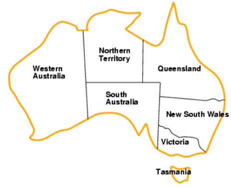
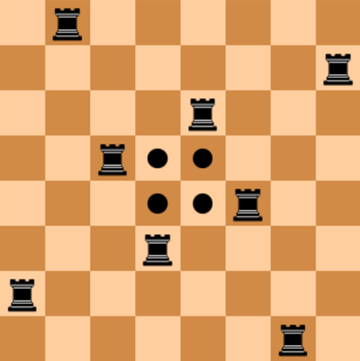
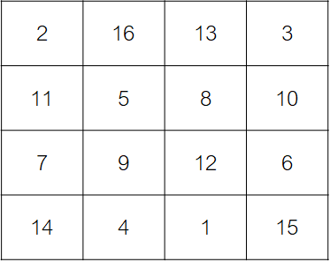

# Аудиториска вежба 5 - Проблеми кои задоволуваат услови

## Задача 1 - Боење на мапа

Дадена ни е мапата на Австралија и треба да ја обоиме со три бои: сина, зелена и црвена. Соседните региони не смее да
имаат иста боја. Секој регион може да има една од трите бои.



## Задача 2 - Топови

Дадена ни е 8x8 табла за шах. Треба да се постават 8 топови на таблата така што ниеден топ да не се напаѓа. Топовите
може да се постават на било која позиција која сметаме дека е најсоодветна. Единственото ограничување е дека не треба да
се напаѓаат.

Ако не сакаме топовите да се напаѓаат треба нивната редица и колона да биде
различна. Секој топ постави го во различна колона стави ги редиците како променливи. Треба да одлучиме во која редица ќе
го
поставиме секој топ. (може и обратно – постави ги во различни редици и стави колони како променливи)

- Променливи: rook1, rook2,…rook8
- Домени: 𝐷𝑖 = {0,1,2, … 7}



## Задача 3 - Магичен квадрат

Магичен квaдрат е nxn квадратна матрица (каде nе бројот на ќелии на секоја страна) пополнет со различни природни броеви
во
ранг 1,2,….,n2 така што секоја ќелија содржи различен број и сумата на секој ред, колона и дијагонала е иста.Сумата се
нарекува магична константа или магична сума на магичниот квадрат.

Даден ни е 4x4 магичен квадрат. Треба да ги пополниме ќелиите со различни природни броеви во ранг 1,2,…,16 така што
секоја ќелија ќе содржи различен број и сумата на секој ред, колона и дијагонала ќе биде 34.



- 16 позиции кои треба да бидат пополнети со 16 различни вредности
- Променливи: position1,position2,….,position16
- Домени: 𝐷𝑖 = {1,2, … .16} за секоја променлива

## Дополнување

Не мора функциските ограничувања да ги поставувате со lambda expression. Како што и претходно објаснивме во првите
аудиториски вежби, lambda expression е анонимна функција па може да си решавате и со функција.

```problem.addConstraint(lambda r1, r2: r1[0] != r2[0] and r1[1] != r2[1], (rook1, rook2))```

може да се замени со

```problem.addConstraint(rooks_attacking_constraint, (rook1, rook2))```

каде rooks_attacking_constraint ви е функција дефинирана претходно (види пример ***rooks_problem_without_lambda.py***)