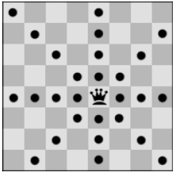
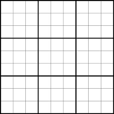

## Задача 1 - meeting

Потребно е да се закаже состанок во петок за Марија, Петар и Симона. Симона како менаџер мора да присуствува на
состанокот со најмалку уште една личност. Состанокот трае еден час, и може да се закаже во периодот од 12:00 до 20:00.
Почетокот на состанокот може да биде на секој час, односно состанокот може да почне во 12:00, но не во 12:05, 12:10 итн.
За секој од членовите дадени се времињата во кои се слободни:

- Симона слободни термини: 13:00-15:00, 16:00-17:00, 19:00-20:00
- Марија слободни термини: 14:00-16:00, 18:00-19:00
- Петар слободни термини: 12:00-14:00, 16:00-20:00

Потребно е менаџерот Симона да ги добие сите можни почетни времиња за состанокот. Даден е почетен код со кој е креирана
класа за претставување на проблемот, на кој се додадени променливите. Потоа се повикува наоѓање на решение со
BacktrackingSolver. Ваша задача е да ги додадете домените на променливите, како и да ги додадете ограничувањата (
условите) на проблемот.

**Потсетник:** Во дадениот модул constraint веќе се имплементирани следните ограничувања како класи:
AllDifferentConstraint,
AllEqualConstraint, MaxSumConstraint, ExactSumConstraint, MinSumConstraint, InSetConstraint, NotInSetConstraint,
SomeInSetConstraint, SomeNotInSetConstraint.

For example:

````
Result
{'Simona_prisustvo': 1, 'Marija_prisustvo': 1, 'Petar_prisustvo': 0, 'vreme_sostanok': 14}
{'Simona_prisustvo': 1, 'Marija_prisustvo': 0, 'Petar_prisustvo': 1, 'vreme_sostanok': 19}
{'Simona_prisustvo': 1, 'Marija_prisustvo': 0, 'Petar_prisustvo': 1, 'vreme_sostanok': 16}
{'Simona_prisustvo': 1, 'Marija_prisustvo': 0, 'Petar_prisustvo': 1, 'vreme_sostanok': 13}
````

````
Starter code:
from constraint import *

if __name__ == '__main__':
    problem = Problem(BacktrackingSolver())
    
    # ---Dadeni se promenlivite, dodadete gi domenite-----
    problem.addVariable("Marija_prisustvo", ...)
    problem.addVariable("Simona_prisustvo", ...)
    problem.addVariable("Petar_prisustvo", ...)
    problem.addVariable("vreme_sostanok", ...)
    # ----------------------------------------------------
    
    # ---Tuka dodadete gi ogranichuvanjata----------------
    
    # ----------------------------------------------------
    
    [print(solution) for solution in problem.getSolutions()]
````

## Задача 2 - paper_presentation_schedule

Потребно е да направите распоред за презентација на трудови за некоја конференција. На конференцијата треба да бидат
презентирани вкупно 10 трудови од неколку области: Вештачка интелигенција (AI), Машинско Учење (ML) и Обработка на
природни јазици (NLP). Ваша задача е да направите распоред за конференција по термини и при тоа да се земат предвид
следните ограничувања:

- Во секој од термините може да бидат презентирани најмногу 4 трудови.
- Ако бројот на трудови од дадена област е помал или еднаков на максималниот број трудови кои може да бидат презентирани
  во даден термин, тогаш тие трудови треба да бидат распределени во ист термин.

Од стандарден влез се чита бројот на термини во кои треба да бидат распределени трудовите (**Напомена:** бројот на
термини
секогаш ќе биде 3 или 4). Потоа се читаат информации за секој труд во следниот формат „ID област“.

На стандарден излез да се испечати терминот за презентација за секој труд. **Напомена:** решението ќе се смета за точно
доколку ги добиете истите групи на трудови распределени во различен термин. На пример, следните 2 можни распределби се
сметаат за идентични:

- Paper1 (AI): T1, Paper2 (AI): T1, Paper3 (ML): T2
- Paper1 (AI): T2, Paper2 (AI): T2, Paper3 (ML): T1

Даден е почетен код со кој е креирана класа за претставување на проблемот, на кој се додадени променливите. Потоа се
повикува наоѓање на решение со BacktrackingSolver. Ваша задача е да ги додадете домените на променливите, како и да ги
додадете ограничувањата (условите) на проблемот.

**Потсетник:** Во дадениот модул constraint веќе се имплементирани следните ограничувања како класи:
AllDifferentConstraint,
AllEqualConstraint, MaxSumConstraint, ExactSumConstraint, MinSumConstraint, InSetConstraint, NotInSetConstraint,
SomeInSetConstraint, SomeNotInSetConstraint.

````
For example:
====================
Input
3
Paper1 AI
Paper2 ML
Paper3 AI
Paper4 AI
Paper5 NLP
Paper6 ML
Paper7 ML
Paper8 NLP
Paper9 NLP
Paper10 ML
end

Result
Paper1 (AI): T3
Paper2 (ML): T2
Paper3 (AI): T3
Paper4 (AI): T3
Paper5 (NLP): T1
Paper6 (ML): T2
Paper7 (ML): T2
Paper8 (NLP): T1
Paper9 (NLP): T1
Paper10 (ML): T2
====================
Input
4
Paper1 AI
Paper2 ML
Paper3 AI
Paper4 AI
Paper5 NLP
Paper6 ML
Paper7 ML
Paper8 NLP
Paper9 NLP
Paper10 ML
end

Result
Paper1 (AI): T4
Paper2 (ML): T3
Paper3 (AI): T4
Paper4 (AI): T4
Paper5 (NLP): T2
Paper6 (ML): T3
Paper7 (ML): T3
Paper8 (NLP): T2
Paper9 (NLP): T2
Paper10 (ML): T3
====================
Input
3
Paper1 AI
Paper2 AI
Paper3 AI
Paper4 AI
Paper5 NLP
Paper6 AI
Paper7 NLP
Paper8 NLP
Paper9 NLP
Paper10 NLP
end

Result
Paper1 (AI): T3
Paper2 (AI): T3
Paper3 (AI): T3
Paper4 (AI): T2
Paper5 (NLP): T2
Paper6 (AI): T2
Paper7 (NLP): T2
Paper8 (NLP): T1
Paper9 (NLP): T1
Paper10 (NLP): T3
====================
Input
4
Paper1 AI
Paper2 AI
Paper3 AI
Paper4 AI
Paper5 NLP
Paper6 AI
Paper7 NLP
Paper8 NLP
Paper9 NLP
Paper10 NLP
end

Result
Paper1 (AI): T4
Paper2 (AI): T4
Paper3 (AI): T4
Paper4 (AI): T3
Paper5 (NLP): T3
Paper6 (AI): T3
Paper7 (NLP): T3
Paper8 (NLP): T2
Paper9 (NLP): T2
Paper10 (NLP): T4
====================
Input
3
Paper1 AI
Paper2 AI
Paper3 AI
Paper4 AI
Paper5 AI
Paper6 AI
Paper7 AI
Paper8 NLP
Paper9 NLP
Paper10 NLP
end

Result
Paper1 (AI): T3
Paper2 (AI): T2
Paper3 (AI): T2
Paper4 (AI): T2
Paper5 (AI): T2
Paper6 (AI): T1
Paper7 (AI): T1
Paper8 (NLP): T3
Paper9 (NLP): T3
Paper10 (NLP): T3
````

````
Starter code:
from constraint import *

if __name__ == '__main__':
    num = int(input())
    
    papers = dict()
    
    paper_info = input()
    while paper_info != 'end':
        title, topic = paper_info.split(' ')
        papers[title] = topic
        paper_info = input()
    
    # Tuka definirajte gi promenlivite
    ...
     
    domain = [f'T{i + 1}' for i in range(num)]
    
    problem = Problem(BacktrackingSolver())
    
    # Dokolku vi e potrebno moze da go promenite delot za dodavanje na promenlivite
    problem.addVariables(variables, domain)
    
    # Tuka dodadete gi ogranichuvanjata
    ...
        
    result = problem.getSolution()
    
    # Tuka dodadete go kodot za pechatenje
    ...
````

## Задача 3 - nQueens

Дадена е nxn табла за шах. Треба да се постават n кралици на таблата така што ниедна кралица да не се напаѓа. Кралиците
може да се постават на било која позиција која сметаме дека е најсоодветна. Единственото ограничување е дека не треба да
се напаѓаат. Можните придвижувања на кралицата ви се дадени на сликата подолу:

Слика: nQueens.jpg



На влез се прима бројот на кралици и димензии на таблата n. На излез треба да се испечати бројот на уникатни позиции на
кои може да ги поставете кралиците со default Backtracking Solver ако бројот на кралици е помал или еднаков на 6. Во
спротивно да се испечати само првото решение.

**Потсетник:** Во дадениот модул constraint веќе се имплементирани следните ограничувања како класи:
AllDifferentConstraint, AllEqualConstraint, MaxSumConstraint, ExactSumConstraint, MinSumConstraint, InSetConstraint,
NotInSetConstraint, SomeInSetConstraint, SomeNotInSetConstraint.

````
For example:
Input
7
Result
{1: (6, 6), 2: (5, 4), 3: (4, 2), 4: (3, 0), 5: (2, 5), 6: (1, 3), 7: (0, 1)}
====================
Input
4
Result
48
====================
Input
5
Result
1200
====================
Input
6
Result
2880
====================
Input
8
Result
{1: (7, 7), 2: (6, 3), 3: (4, 2), 4: (3, 5), 5: (1, 6), 6: (5, 0), 7: (0, 4), 8: (2, 1)}
````

````
Starter code:
from constraint import *

if __name__ == '__main__':
    problem = Problem(BacktrackingSolver())
    variables = ["A", "B", "C", "D", "E", "F"]
    for variable in variables:
        problem.addVariable(variable, Domain(set(range(100))))
    
    # ---Tuka dodadete gi ogranichuvanjata----------------
    
    # ----------------------------------------------------
    
    print(problem.getSolution())
````

## Задача 4 - sudoku

Дадена ви е играта судоку. Во оваа игра во секој блок се ставаат бројки од 1 до 9 така што во ниедна редица, колона и
блок не смее да се повторува ниедна цифра. Почетно сите полиња се празни. Вашата задача е да најдете решение на овој
проблем. Просторот ви е даден на сликата подолу.

Слика: sudoku.png



**Забелешка:** На влез добивате со каков `Solver` да работите. Испечатете го само првото решение. **Не е задолжително да
ви поминуваат сите тест примери за задачата да биде точна. Зависи како сте ги поставиле условите.**

**Потсетник:** Во дадениот модул constraint веќе се имплементирани следните ограничувања како класи:
AllDifferentConstraint, AllEqualConstraint, MaxSumConstraint, ExactSumConstraint, MinSumConstraint, InSetConstraint,
NotInSetConstraint, SomeInSetConstraint, SomeNotInSetConstraint.

````
For example:
Input
BacktrackingSolver

Result
{0: 9, 1: 8, 2: 7, 3: 6, 4: 5, 5: 4, 6: 3, 7: 2, 8: 1, 9: 6, 10: 5, 11: 4, 15: 9, 16: 8, 17: 7, 12: 3, 13: 2, 14: 1, 18: 3, 19: 2, 20: 1, 21: 9, 22: 8, 23: 7, 24: 6, 25: 5, 26: 4, 27: 8, 29: 9, 32: 6, 35: 5, 28: 7, 30: 4, 31: 3, 34: 1, 33: 2, 40: 9, 49: 7, 51: 8, 42: 7, 44: 6, 43: 4, 37: 3, 38: 5, 36: 2, 41: 8, 39: 1, 47: 6, 45: 4, 46: 1, 48: 5, 50: 2, 52: 9, 53: 3, 54: 7, 57: 8, 56: 3, 61: 6, 55: 9, 59: 5, 62: 2, 58: 4, 60: 1, 63: 5, 69: 4, 64: 6, 67: 1, 72: 1, 73: 4, 76: 6, 78: 5, 65: 8, 71: 9, 68: 3, 70: 7, 66: 2, 74: 2, 75: 7, 77: 9, 79: 3, 80: 8}
====================
Input
RecursiveBacktrackingSolver

Result
{0: 1, 1: 2, 2: 3, 3: 4, 4: 5, 5: 6, 6: 7, 7: 8, 8: 9, 9: 4, 10: 5, 11: 6, 15: 1, 16: 2, 17: 3, 12: 7, 13: 8, 14: 9, 18: 7, 19: 8, 20: 9, 21: 1, 22: 2, 23: 3, 24: 4, 25: 5, 26: 6, 27: 2, 29: 1, 32: 4, 35: 5, 28: 3, 30: 6, 31: 7, 34: 9, 33: 8, 40: 1, 49: 3, 51: 2, 42: 3, 44: 4, 43: 6, 37: 7, 38: 5, 36: 8, 41: 2, 39: 9, 47: 4, 45: 6, 46: 9, 48: 5, 50: 8, 52: 1, 53: 7, 54: 3, 57: 2, 56: 7, 61: 4, 55: 1, 59: 5, 62: 8, 58: 6, 60: 9, 63: 5, 69: 6, 64: 4, 67: 9, 72: 9, 73: 6, 76: 4, 78: 5, 65: 2, 71: 1, 68: 7, 70: 3, 66: 8, 74: 8, 75: 3, 77: 1, 79: 7, 80: 2}
====================
Input
MinConflictsSolver

Result
None
````

````
Starter code:
from constraint import *

if __name__ == '__main__':
    problem = Problem(BacktrackingSolver())
    variables = []
    for variable in variables:
        problem.addVariable(variable, Domain(set(range(100))))
    
    # ---Tuka dodadete gi ogranichuvanjata----------------
    
    # ----------------------------------------------------
    
    print(problem.getSolution())
````

## Задача 5 - team_forming

Потребно е да составите тим кој се состои од 1 тим лидер и 5 членови. Членовите се избираат од множество на N1 можни
членови. Тим лидерот се избира од множество на N2 можни тим лидери. Притоа, секој член и тим лидер има одредена тежина (
реална вредност помеѓу 0 и 100). Ваша задача е да креирате оптимален тим. Оптимален тим е тимот чија сума на тежини е
највисока. Дополнително, сумата не треба да биде поголема од 100. Не е можно еден тим лидер или еден член да се избере
повеќе од еднаш.

Од стандарден влез се чита бројот на можни членови, а потоа се читаат информации за секој член во следниот формат
„тежина име“. Потоа, се чита бројот на можни тим лидери и информациите за секој тим лидер во следниот формат „тежина
име“.

На стандарден излез да се испечати вкупната сума за формираниот тим. Потоа да се испечатат тим лидерот и членовите на
тимот.

````
For example:
Input
10
31.3 A
28.4 B
26.1 C
24.2 D
21.8 E
20.3 F
15.5 G
14.1 H
12.5 I
11.5 J
5
32.2 K
27.4 L
24.6 M
14.9 N
13.2 O

Result
Total score: 100.0
Team leader: O
Participant 1: J
Participant 2: I
Participant 3: H
Participant 4: F
Participant 5: B
====================
Input
10
31.3 P
28.4 Q
26.1 R
24.2 S
21.8 T
20.3 U
15.5 V
14.1 W
12.5 X
11.5 Y
5
6.5 Z
7.8 A
8.7 B
10.1 C
12.6 D

Result
Total score: 100.0
Team leader: D
Participant 1: Y
Participant 2: X
Participant 3: V
Participant 4: T
Participant 5: R
====================
Input
10
31.3 E
28.4 F
26.1 G
24.2 H
21.8 I
8.2 J
9.3 K
9.9 L
10.3 M
10.4 N
5
32.2 O
27.4 P
24.6 Q
14.9 R
13.2 S

Result
Total score: 100.0
Team leader: R
Participant 1: N
Participant 2: E
Participant 3: L
Participant 4: H
Participant 5: K
====================
Input
9
31.3 T
6.0 U
7.7 V
7.9 W
20.3 X
15.5 Y
14.1 Z
10.3 A
10.4 B
4
32.2 C
27.4 D
24.6 E
13.2 F

Result
Total score: 100.0
Team leader: E
Participant 1: B
Participant 2: T
Participant 3: A
Participant 4: W
Participant 5: Y
====================
Input
7
31.3 G
28.4 H
26.1 I
24.2 J
21.8 K
8.2 L
9.3 M
6
6.5 N
7.8 O
8.7 P
27.4 Q
24.6 R
13.2 S

Result
Total score: 98.3
Team leader: P
Participant 1: M
Participant 2: I
Participant 3: L
Participant 4: K
Participant 5: J
````

````
Starter code:
from constraint import *

if __name__ == '__main__':
    ....
````

## Задача 6 - crypto_puzzle

**SEND+MORE=MONEY** е криптоаритметичка загатка, што значи дека станува збор за наоѓање цифри кои ги заменуваат буквите
за да се направи математичкиот израз вистинит. Секоја буква во проблемот претставува една цифра (0–9). Две букви не
можат да ја претставуваат истата цифра. Кога буквата се повторува, тоа значи дека цифрата се повторува во решението.

````
	S	E	N	D
+	M	O	R	E
==================================
M	O	N	E	Y
````

Даден е почетен код со кој е креирана класа за претставување на проблемот, на кој се додадени променливите со нивниот
домен. Потоа се повикува наоѓање на решение со BacktrackingSolver. Ваша задача е да го/ги додадете ограничувањето/њата (
условите) на проблемот.

**Потсетник:** Во дадениот модул constraint веќе се имплементирани следните ограничувања како класи:
AllDifferentConstraint, AllEqualConstraint, MaxSumConstraint, ExactSumConstraint, MinSumConstraint, InSetConstraint,
NotInSetConstraint, SomeInSetConstraint, SomeNotInSetConstraint.

````
For example:
Result
{'D': 9, 'E': 8, 'M': 0, 'N': 1, 'O': 3, 'R': 6, 'S': 2, 'Y': 7}
````

````
Starter code:
from constraint import *

if __name__ == '__main__':
    problem = Problem(BacktrackingSolver())
    variables = ["S", "E", "N", "D", "M", "O", "R", "Y"]
    for variable in variables:
        problem.addVariable(variable, Domain(set(range(10))))
    
    # ---Tuka dodadete gi ogranichuvanjata----------------
    
    # ----------------------------------------------------
    
    print(problem.getSolution())
````
