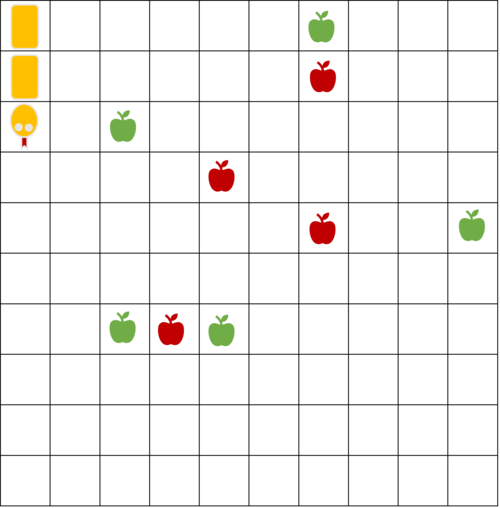
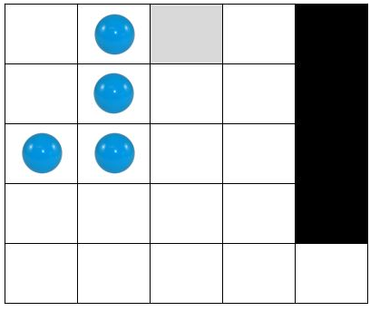
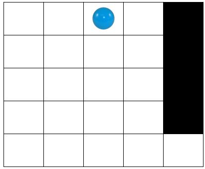
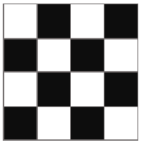
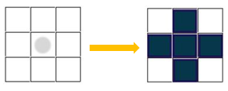

## Задача 1 - snake

Предложете соодветна репрезентација и напишете ги потребните функции во Python за да се реши следниот проблем за кој
една можна почетна состојба е прикажана на Слика 1: snake1.png



„Во табла со димензии 10x10 се наоѓаат змија, зелени јаболки и црвени јаболки. Потребно е змијата да ги изеде зелените
јаболки, а да ги одбегнува црвените јаболки кои се отровни. Змијата на почетокот зафаќа три полиња од таблата, едно поле
за главата и две полиња за телото. При секое јадење на зелена јаболка телото на змијата се издолжува на крајот за едно
поле (пример Слика 2). Во даден момент можни се три акции на движење на змијата: продолжи право, сврти лево и сврти
десно. При движењето на змијата треба да се внимава змијата да не се изеде сама себе (колизија на главата на змијата со
некој дел од телото) и да не излезе надвор од таблата. Потребно е проблемот да се реши во најмал број на потези.“

Слика 2: snake2.png


За сите тест примери изгледот и големината на таблата се исти како на примерот даден на сликата. За сите тест примери
почетната позиција на змијата е иста. За секој тест пример се менува бројот и почетната позиција на зелените и црвените
јаболки.

Во рамки на почетниот код даден за задачата се вчитуваат влезните аргументи за секој тест пример. Во променливата
crveni_jabolki се сочувани позициите на црвените јаболки (како листа од торки), а во променливата zeleni_jabolki се
сочувани позициите на зелените јаболки. Табелата се претставува како координатен систем со координати x и y почнувајќи
од нула, па соодветно, позициите се зададени како торка со прв елемент x и втор елемент y.

Движењата на змијата треба да ги именувате на следниот начин:
ProdolzhiPravo - змијата се придвижува за едно поле нанапред
SvrtiDesno - змијата се придвижува за едно поле на десно
SvrtiLevo - змијата се придвижува за едно поле на лево

Вашиот код треба да има само еден повик на функција за приказ на стандарден излез (print) со кој ќе ја вратите
секвенцата на движења која змијата треба да ја направи за да може да ги изеде сите зелени јаболки. Да се најде решението
со најмал број на преземени акции употребувајќи некој алгоритам за неинформирано пребарување. Врз основа на тест
примерите треба самите да определите кое пребарување ќе го користите.

````
For example:
Input
5
6,9
2,7
9,5
2,3
4,3
4
4,6
6,5
3,3
6,8

Result
['SvrtiLevo', 'ProdolzhiPravo', 'SvrtiDesno', 'ProdolzhiPravo', 'ProdolzhiPravo', 'ProdolzhiPravo', 'ProdolzhiPravo', 'SvrtiLevo', 'ProdolzhiPravo', 'SvrtiLevo', 'ProdolzhiPravo', 'SvrtiDesno', 'ProdolzhiPravo', 'ProdolzhiPravo', 'ProdolzhiPravo', 'ProdolzhiPravo', 'SvrtiLevo', 'ProdolzhiPravo', 'ProdolzhiPravo', 'ProdolzhiPravo', 'ProdolzhiPravo', 'SvrtiLevo', 'ProdolzhiPravo', 'ProdolzhiPravo']
====================
Input
0
4
4,6
6,5
3,6
6,8

Result
[]
====================
Input
6
3,7
4,7
5,7
5,5
3,5
3,9
5
3,8
4,6
0,6
1,6
2,6

Result
['SvrtiLevo', 'ProdolzhiPravo', 'ProdolzhiPravo', 'SvrtiDesno', 'ProdolzhiPravo', 'SvrtiLevo', 'ProdolzhiPravo', 'SvrtiLevo', 'ProdolzhiPravo', 'SvrtiLevo', 'SvrtiDesno', 'ProdolzhiPravo', 'SvrtiLevo']
====================
Input
5
1,7
2,7
0,4
1,5
2,6
6
0,6
0,5
3,5
1,4
2,4
3,4

Result
['SvrtiLevo', 'SvrtiDesno', 'ProdolzhiPravo', 'SvrtiLevo', 'SvrtiLevo', 'ProdolzhiPravo', 'SvrtiDesno', 'ProdolzhiPravo', 'SvrtiDesno', 'ProdolzhiPravo', 'ProdolzhiPravo', 'ProdolzhiPravo', 'SvrtiDesno', 'ProdolzhiPravo', 'ProdolzhiPravo', 'ProdolzhiPravo', 'SvrtiDesno']
====================
Input
7
3,6
4,7
4,5
4,4
4,3
5,4
6,5
7
3,9
3,8
3,7
5,7
3,5
5,5
5,3

Result
['ProdolzhiPravo', 'SvrtiLevo', 'ProdolzhiPravo', 'ProdolzhiPravo', 'ProdolzhiPravo', 'SvrtiDesno', 'ProdolzhiPravo', 'SvrtiLevo', 'ProdolzhiPravo', 'SvrtiLevo', 'ProdolzhiPravo', 'ProdolzhiPravo', 'ProdolzhiPravo', 'SvrtiLevo', 'ProdolzhiPravo', 'SvrtiLevo', 'ProdolzhiPravo', 'ProdolzhiPravo', 'ProdolzhiPravo', 'ProdolzhiPravo']
====================
Input
7
2,5
4,7
4,3
5,4
5,7
6,5
8,7
11
1,7
1,6
1,5
1,4
2,8
2,2
3,8
3,6
3,5
3,4
3,3

Result
['ProdolzhiPravo', 'ProdolzhiPravo', 'ProdolzhiPravo', 'ProdolzhiPravo', 'SvrtiLevo', 'ProdolzhiPravo', 'SvrtiLevo', 'ProdolzhiPravo', 'ProdolzhiPravo', 'ProdolzhiPravo', 'SvrtiDesno', 'ProdolzhiPravo', 'ProdolzhiPravo', 'ProdolzhiPravo', 'ProdolzhiPravo', 'ProdolzhiPravo', 'SvrtiDesno', 'ProdolzhiPravo', 'SvrtiDesno', 'ProdolzhiPravo', 'ProdolzhiPravo', 'SvrtiLevo', 'ProdolzhiPravo', 'SvrtiDesno']
====================
Input
8
0,4
1,4
2,5
2,3
3,6
3,4
4,5
4,4
11
1,6
1,5
1,3
2,7
2,2
3,7
4,7
3,3
3,5
5,6
5,5

Result
['ProdolzhiPravo', 'ProdolzhiPravo', 'ProdolzhiPravo', 'SvrtiLevo', 'ProdolzhiPravo', 'ProdolzhiPravo', 'ProdolzhiPravo', 'ProdolzhiPravo', 'ProdolzhiPravo', 'ProdolzhiPravo', 'SvrtiDesno', 'SvrtiDesno', 'ProdolzhiPravo', 'ProdolzhiPravo', 'SvrtiDesno', 'ProdolzhiPravo', 'ProdolzhiPravo', 'SvrtiLevo', 'ProdolzhiPravo', 'SvrtiLevo', 'ProdolzhiPravo', 'ProdolzhiPravo']
````

## Задача 2 - football

Дадена е табла 8x6, каде што се поставени човече и топка. Потребно е човечето со туркање на топката да ја доведе до
голот кој е обележан со сива боја. На таблата дополнително има противници кои се обележани со сина боја. Противниците се
статични и не се движат.

Човечето може да се движи во пет насоки: горе, долу, десно, горе-десно и долу-десно за една позиција. При движењето,
доколку пред него се наоѓа топката, може да ја турне топката во насоката во која се движи. Човечето не може да се наоѓа
на истото поле како топката или некој од противниците. Топката исто така не може да се наоѓа на поле кое е соседно со
некој од противниците (хоризнотално, вертикално или дијагонално) или на исто поле со некој од противниците.

На слика 1 е покажана една можна почетна состојба на таблата.

Слика 1: football.png


За сите тест примери големината на таблата е иста, а позицијата на човечето и топката се менуваат и се читаат од
стандарден влез. Позицијата на противниците и голот е иста за сите тест примери. Ваша задача е да го имплементирате
поместувањето на човечето (со тоа и туркањето на топката) во successor функцијата. Акциите се именуваат како „Pomesti
coveche gore/dolu/desno/gore-desno/dolu-desno“ ако се поместува човечето, или како „Turni topka
gore/dolu/desno/gore-desno/dolu-desno“ ако при поместувањето на чoвечето се турнува и топката. Дополнително, потребно е
да проверите дали сте стигнале до целта, односно да ја имплементирате функцијата goal_test и да проверите дали
состојбата е валидна, односно да ја дополните функцијата check_valid. Треба да примените неинформирано пребарување за да
најдете решение со најмал број на чекори.

````
For example:
Input
0,1
1,2

Result
['Pomesti coveche gore', 'Pomesti coveche gore', 'Turni topka dolu-desno', 'Pomesti coveche dolu', 'Turni topka desno', 'Turni topka desno', 'Turni topka desno', 'Pomesti coveche dolu', 'Turni topka gore-desno', 'Turni topka gore-desno']
````

## Задача 3 - pacman

Предложете соодветна репрезентација на играта Pacman и напишете ги потребните функции во Python за да се реши следниот
проблем за кој една можна почетна состојба е прикажана на Слика 1:

Слика 1: pacman_1.png


"Во табла со димензии 10x10 се наоѓа човече. Човечето може да се придвижува на кое било соседно поле хоризонтално или
вертикално, доколку на соодветната позиција не постои пречка. Потребно е човечето да ги изеде сите точки поставени во
таблата. Во даден момент можни се четири акции на движење на човечето: продолжи право, продолжи назад, сврти лево и
сврти десно. На Слика 2 се прикажани можните движења на човечето за две насоки, каде што со сина боја е обележана новата
позиција добиена со акцијата продолжи право, продолжи назад со црвена боја, сврти лево со сива боја и сврти десно со
зелена боја. Потребно е проблемот да се реши во најмал број на потези."

Слика 2: pacman_2.png


За сите тест примери изгледот и големината на таблата се исти како на примерот даден на Слика 1. За сите тест примери
позициите на пречките се исти. За секој тест пример почетната позиција на човечето се менува, а исто така се менуваат и
позиците на точките.

Од стандарден влез се читаат почетните x и y координати во кои на почетокот се наоѓа човечето (ако таблата ја гледате во
стандардниот координатен систем). Следно се чита насоката кон која е поставен играчот ('istok', 'zapad', 'sever', '
jug'). Потоа се чита број на точки во таблата, по што во секој нов ред се читаат x и y координатите на точките во
таблата (ако таблата ја гледате во стандардниот координатен систем).

Движењата на човечето потребно е да ги именувате на следниот начин:
ProdolzhiPravo - за придвижување на човечето за едно поле нанапред
ProdolzhiNazad - за придвижување на човечето за едно поле наназад
SvrtiLevo - за придвижување на човечето за едно поле налево
SvrtiDesno - за придвижување на човечето за едно поле надесно

Вашиот код треба да има само еден повик на функција за приказ на стандарден излез (print) со кој ќе ја вратите
секвенцата на движења која човечето треба да ја направи за да може од својата почетна позиција да стигне до позицијата
на куќичката. Треба да примените неинформирано пребарување. Врз основа на тест примерите треба самите да определите кое
пребарување ќе го користите.

НАПОМЕНА: Подреденоста на акциите во successor функција е важна кај неинформирано пребарување. Соодветно, за да се добие
решението кое се очекува во изгенерираните излези, редоследот треба да биде ProdolzhiPravo, ProdolzhiNazad, SvrtiLevo,
SvrtiDesno. Доколку акциите не се подредени со истиот редослед, можно е да се најде исто оптимално решение со различна
патека.

````
For example:
Input
0
0
istok
5
2,6
4,0
6,5
8,2
8,3

Result
['ProdolzhiPravo', 'ProdolzhiPravo', 'ProdolzhiPravo', 'ProdolzhiPravo', 'ProdolzhiNazad', 'ProdolzhiPravo', 'SvrtiDesno', 'ProdolzhiPravo', 'ProdolzhiPravo', 'ProdolzhiPravo', 'ProdolzhiPravo', 'ProdolzhiPravo', 'ProdolzhiNazad', 'ProdolzhiPravo', 'SvrtiLevo', 'ProdolzhiPravo', 'ProdolzhiPravo', 'ProdolzhiPravo', 'SvrtiLevo', 'ProdolzhiNazad', 'ProdolzhiPravo', 'SvrtiLevo', 'ProdolzhiPravo', 'SvrtiDesno']
====================
Input
9
5
sever
2
5,0
0,7

Result
['ProdolzhiPravo', 'SvrtiLevo', 'ProdolzhiPravo', 'ProdolzhiPravo', 'SvrtiDesno', 'ProdolzhiPravo', 'SvrtiLevo', 'ProdolzhiPravo', 'ProdolzhiPravo', 'ProdolzhiPravo', 'ProdolzhiPravo', 'SvrtiLevo', 'SvrtiDesno', 'ProdolzhiNazad', 'ProdolzhiPravo', 'SvrtiDesno', 'ProdolzhiPravo', 'ProdolzhiPravo', 'ProdolzhiPravo', 'ProdolzhiPravo', 'ProdolzhiPravo', 'ProdolzhiPravo', 'SvrtiLevo', 'ProdolzhiPravo', 'ProdolzhiPravo']
====================
Input
9
9
jug
4
3,5
3,7
5,5
5,7

Result
['SvrtiDesno', 'ProdolzhiPravo', 'SvrtiLevo', 'ProdolzhiPravo', 'SvrtiDesno', 'ProdolzhiPravo', 'ProdolzhiNazad', 'SvrtiDesno', 'ProdolzhiPravo', 'SvrtiDesno', 'SvrtiLevo', 'SvrtiDesno', 'ProdolzhiPravo', 'SvrtiDesno', 'SvrtiLevo', 'SvrtiDesno', 'ProdolzhiPravo', 'SvrtiDesno']
====================
Input
0
7
istok
2
0,0
9,9

Result
['ProdolzhiPravo', 'SvrtiDesno', 'ProdolzhiPravo', 'SvrtiDesno', 'SvrtiLevo', 'ProdolzhiPravo', 'ProdolzhiPravo', 'ProdolzhiPravo', 'ProdolzhiPravo', 'ProdolzhiNazad', 'ProdolzhiPravo', 'ProdolzhiPravo', 'ProdolzhiPravo', 'ProdolzhiPravo', 'SvrtiDesno', 'ProdolzhiPravo', 'SvrtiLevo', 'ProdolzhiPravo', 'ProdolzhiPravo', 'SvrtiDesno', 'ProdolzhiPravo', 'ProdolzhiPravo', 'ProdolzhiPravo', 'ProdolzhiPravo', 'SvrtiLevo', 'SvrtiDesno', 'ProdolzhiPravo']
====================
Input
4
3
sever
10
2,3
3,3
5,3
6,3
7,3
8,3
9,3
9,2
8,2
7,2

Result
['SvrtiLevo', 'ProdolzhiPravo', 'ProdolzhiNazad', 'ProdolzhiPravo', 'ProdolzhiPravo', 'ProdolzhiPravo', 'ProdolzhiPravo', 'ProdolzhiPravo', 'ProdolzhiPravo', 'SvrtiDesno', 'SvrtiDesno', 'ProdolzhiPravo']
====================
Input
4
3
jug
8
3,2
3,3
3,4
4,2
4,4
5,2
5,3
5,4

Result
['ProdolzhiPravo', 'SvrtiLevo', 'SvrtiLevo', 'ProdolzhiPravo', 'SvrtiLevo', 'ProdolzhiPravo', 'SvrtiLevo', 'ProdolzhiPravo']
====================
Input
0
0
istok
1
0,7

Result
['SvrtiLevo', 'ProdolzhiPravo', 'ProdolzhiPravo', 'ProdolzhiPravo', 'ProdolzhiPravo', 'SvrtiDesno', 'SvrtiLevo', 'ProdolzhiPravo', 'SvrtiLevo']
====================
Input
0
0
istok
0

Result
[]
====================
Input
3
3
zapad
6
4,0
5,0
5,7
7,2
8,2
9,2

Result
['SvrtiLevo', 'ProdolzhiPravo', 'ProdolzhiPravo', 'SvrtiLevo', 'ProdolzhiPravo', 'ProdolzhiNazad', 'ProdolzhiPravo', 'SvrtiDesno', 'ProdolzhiPravo', 'ProdolzhiPravo', 'SvrtiDesno', 'ProdolzhiPravo', 'ProdolzhiPravo', 'ProdolzhiPravo', 'ProdolzhiPravo', 'ProdolzhiPravo', 'SvrtiDesno', 'SvrtiDesno', 'ProdolzhiPravo', 'SvrtiDesno', 'ProdolzhiPravo', 'ProdolzhiPravo', 'ProdolzhiPravo', 'ProdolzhiPravo', 'SvrtiLevo', 'ProdolzhiPravo']
====================
Input
5
7
jug
3
0,0
9,0
9,9

Result
['ProdolzhiNazad', 'SvrtiDesno', 'ProdolzhiPravo', 'SvrtiLevo', 'SvrtiDesno', 'ProdolzhiPravo', 'ProdolzhiNazad', 'ProdolzhiPravo', 'SvrtiLevo', 'ProdolzhiPravo', 'ProdolzhiPravo', 'ProdolzhiPravo', 'ProdolzhiPravo', 'ProdolzhiPravo', 'ProdolzhiPravo', 'ProdolzhiPravo', 'ProdolzhiPravo', 'SvrtiLevo', 'ProdolzhiPravo', 'ProdolzhiNazad', 'ProdolzhiPravo', 'SvrtiDesno', 'ProdolzhiPravo', 'ProdolzhiPravo', 'SvrtiLevo', 'ProdolzhiPravo', 'ProdolzhiPravo', 'ProdolzhiPravo', 'ProdolzhiPravo', 'SvrtiLevo', 'ProdolzhiPravo', 'ProdolzhiPravo', 'SvrtiDesno', 'ProdolzhiPravo']
````

## Задача 4 - disks

Предложете соодветна репрезентација и напишете ги потребните функции во Python за да се реши следниот проблем за кој
една можна почетна состојба е прикажана на Слика 1.

“На една лента составена од L полиња поставени се N дискови (N < L). Дисковите се меѓусебно различни и се нумерирани со
целите броеви од 1 до N. На почетокот, дисковите се позиционирани во првите N полиња од лентата (гледајќи одлево -
надесно), подредени во растечки редослед според нивните редни броеви (Слика 1 - почетна состојба за N = 3 и L = 7).
Потребно е дисковите да се доведат на крајот на лентата (во последните N полиња од лентата, гледајќи одлево - надесно),
при што ќе бидат подредени во опаѓачки редослед според нивните редни броеви (како пример, на Слика 2 е прикажана целната
состојба која што соодветствува на почетната состојба прикажана на Слика 1). Во еден потег, еден диск може да се
премести од полето во кое се наоѓа во соседно празно поле (лево или десно). Исто така, диск може да се премести и од
полето во кое се наоѓа -> преку едно поле (во лево или десно), но само ако притоа „прескокнатото“ поле содржи друг
диск (на пример, може да се премести диск од првото во третото поле само ако третото поле е празно и второто поле содржи
друг диск!). Не е дозволено дисковите да излегуваат од лентата. Потребно е проблемот да се реши во најмал број на
потези.”

За сите тест примери изгледот на лентата е ист како на примерот даден на сликите. За сите тест примери распоредот на
дисковите на почетокот е ист (како што беше објаснето погоре). За секој тест пример се менува бројот на дискови, а исто
така се менува и димензијата на лентата.

Од стандарден влез се вчитуваат влезните аргументи за секој тест пример. Најпрво е даден бројот на дискови (N), а потоа
се чита димензијата на лентата (бројот на полиња од кои што е составена истата, L).

Движењата на дисковите потребно е да ги именувате на следниот начин:

- D1: Disk i - за преместување на дискот i надесно во соседно празно поле, i = 1, 2, ..., N
- D2: Disk i - за преместување на дискот i преку едно поле надесно, i = 1, 2, ..., N
- L1: Disk i - за преместување на дискот i налево во соседно празно поле, i = 1, 2, ..., N
- L2: Disk i - за преместување на дискот i преку едно поле налево, i = 1, 2, ..., N

Вашиот код треба да има само еден повик на функција за приказ на стандарден излез (print) со кој ќе ја вратите
секвенцата на движења која треба да се направи за да може дисковите да се доведат на бараните позиции. Треба да
примените неинформирано пребарување. Врз основа на тест примерите треба самите да определите кое пребарување ќе го
користите.

НАПОМЕНА: Подреденоста на акциите во successor функција е важна кај неинформирано пребарување. Соодветно, за да се добие
решението кое се очекува во изгенерираните излези, редоследот треба да биде D1, D2, L1, L2, за секое од полињата во
лентата последователно, почнувајќи од почетокот. Доколку акциите не се подредени со истиот редослед, можно е да се најде
исто оптимално решение со различна патека.

Слика 1: disk_1.png


Слика 2: disk_2.png


````
For example:
Input
3
7

Expected
['D2: Disk 2', 'D1: Disk 1', 'D2: Disk 3', 'D1: Disk 1', 'D2: Disk 2', 'L1: Disk 3', 'D2: Disk 1', 'D2: Disk 1', 'D1: Disk 3']
====================
Input
2
4

Expected
['D2: Disk 1', 'D1: Disk 1', 'D1: Disk 2']
====================
Input
3
4

Expected
['D2: Disk 2', 'D1: Disk 1', 'L2: Disk 3', 'L1: Disk 2', 'D2: Disk 1', 'D1: Disk 3']
====================
Input
2
5

Expected
['D2: Disk 1', 'D2: Disk 2', 'D2: Disk 1']
====================
Input
3
5

Expected
['D2: Disk 2', 'L1: Disk 3', 'D2: Disk 1', 'D2: Disk 1', 'D1: Disk 3']
====================
Input
4
5

Expected
['D2: Disk 3', 'D2: Disk 1', 'L1: Disk 2', 'L1: Disk 1', 'L1: Disk 4', 'D2: Disk 1', 'D1: Disk 2', 'L2: Disk 4', 'L2: Disk 3', 'D1: Disk 1', 'D2: Disk 2', 'D1: Disk 4']
====================
Input
3
6

Expected
['D2: Disk 2', 'D1: Disk 1', 'D1: Disk 2', 'D2: Disk 1', 'D2: Disk 1', 'D1: Disk 3']
====================
Input
4
6

Expected
['D2: Disk 3', 'D2: Disk 1', 'L1: Disk 2', 'L2: Disk 4', 'D1: Disk 1', 'D2: Disk 2', 'D2: Disk 1', 'L1: Disk 3', 'D2: Disk 2', 'D1: Disk 4']
====================
Input
5
6

Expected
['D2: Disk 4', 'D2: Disk 2', 'D1: Disk 1', 'L2: Disk 3', 'L2: Disk 5', 'L1: Disk 4', 'D2: Disk 2', 'D2: Disk 1', 'D1: Disk 3', 'L2: Disk 5', 'L2: Disk 4', 'L1: Disk 2', 'D2: Disk 1', 'D2: Disk 3', 'D1: Disk 5']
====================
Input
4
7

Expected
['D2: Disk 3', 'D2: Disk 1', 'D1: Disk 3', 'D2: Disk 1', 'L1: Disk 4', 'D2: Disk 2', 'D2: Disk 1', 'L1: Disk 3', 'D2: Disk 2', 'D1: Disk 4']
````

## Задача 5 - hanoi

Во серија се наредени N кружни столбови со иста висина. На почетокот, на само еден од столбовите наредени се M камени
блокови во форма на крофни со различна големина. Блоковите се наредени како кула т.н. најголемиот блок е поставен
најдоле на столбот, а секој блок после него е помал од својот претходник подолу.

Крајната цел е кулата од почетниот столб да се премести на некој друг столб т.ш. ќе биде запазен оригиналниот редослед
на блоковите.

Слика: hanoi.jpg


Ваша задача е преку техниката на неинформирано пребарување низ простор на состојби да одредите кој е најмалиот број на
чекори потребни да се пресметат блоковите од почетниот столб до крајниот т.ш. важи правилото дека во секој чекор само
еден блок од врвот на некој столб може да се помести на некој друг столб ако е помал од блокот на врвот на другиот столб
или другиот столб е празен. Во почетниот код дадено ви е читањето од стандарден влез на почетната и целната состојба на
столбовите, т.ш. секој столб е претставен со посебна торка а броевите ги означуваат големините на блоковите. На
стандарден излез испечатете го минималниот број на потребни чекори да се реши проблемот како и редоследот на потребните
акции кои се во форматот MOVE TOP BLOCK FROM PILLAR i TO PILLAR j.

````
For example:
Input
3,2,1;;
;;3,2,1

Result
Number of action 7
['MOVE TOP BLOCK FROM PILLAR 1 TO PILLAR 3', 'MOVE TOP BLOCK FROM PILLAR 1 TO PILLAR 2', 'MOVE TOP BLOCK FROM PILLAR 3 TO PILLAR 2', 'MOVE TOP BLOCK FROM PILLAR 1 TO PILLAR 3', 'MOVE TOP BLOCK FROM PILLAR 2 TO PILLAR 1', 'MOVE TOP BLOCK FROM PILLAR 2 TO PILLAR 3', 'MOVE TOP BLOCK FROM PILLAR 1 TO PILLAR 3']
====================
Input
;;4,3,2,1
;4,3,2,1;

Result
Number of action 15
['MOVE TOP BLOCK FROM PILLAR 3 TO PILLAR 1', 'MOVE TOP BLOCK FROM PILLAR 3 TO PILLAR 2', 'MOVE TOP BLOCK FROM PILLAR 1 TO PILLAR 2', 'MOVE TOP BLOCK FROM PILLAR 3 TO PILLAR 1', 'MOVE TOP BLOCK FROM PILLAR 2 TO PILLAR 3', 'MOVE TOP BLOCK FROM PILLAR 2 TO PILLAR 1', 'MOVE TOP BLOCK FROM PILLAR 3 TO PILLAR 1', 'MOVE TOP BLOCK FROM PILLAR 3 TO PILLAR 2', 'MOVE TOP BLOCK FROM PILLAR 1 TO PILLAR 2', 'MOVE TOP BLOCK FROM PILLAR 1 TO PILLAR 3', 'MOVE TOP BLOCK FROM PILLAR 2 TO PILLAR 3', 'MOVE TOP BLOCK FROM PILLAR 1 TO PILLAR 2', 'MOVE TOP BLOCK FROM PILLAR 3 TO PILLAR 1', 'MOVE TOP BLOCK FROM PILLAR 3 TO PILLAR 2', 'MOVE TOP BLOCK FROM PILLAR 1 TO PILLAR 2']
====================
Input
6,5,4,3,2,1;;
;;6,5,4,3,2,1

Result
Number of action 63
['MOVE TOP BLOCK FROM PILLAR 1 TO PILLAR 2', 'MOVE TOP BLOCK FROM PILLAR 1 TO PILLAR 3', 'MOVE TOP BLOCK FROM PILLAR 2 TO PILLAR 3', 'MOVE TOP BLOCK FROM PILLAR 1 TO PILLAR 2', 'MOVE TOP BLOCK FROM PILLAR 3 TO PILLAR 1', 'MOVE TOP BLOCK FROM PILLAR 3 TO PILLAR 2', 'MOVE TOP BLOCK FROM PILLAR 1 TO PILLAR 2', 'MOVE TOP BLOCK FROM PILLAR 1 TO PILLAR 3', 'MOVE TOP BLOCK FROM PILLAR 2 TO PILLAR 3', 'MOVE TOP BLOCK FROM PILLAR 2 TO PILLAR 1', 'MOVE TOP BLOCK FROM PILLAR 3 TO PILLAR 1', 'MOVE TOP BLOCK FROM PILLAR 2 TO PILLAR 3', 'MOVE TOP BLOCK FROM PILLAR 1 TO PILLAR 2', 'MOVE TOP BLOCK FROM PILLAR 1 TO PILLAR 3', 'MOVE TOP BLOCK FROM PILLAR 2 TO PILLAR 3', 'MOVE TOP BLOCK FROM PILLAR 1 TO PILLAR 2', 'MOVE TOP BLOCK FROM PILLAR 3 TO PILLAR 1', 'MOVE TOP BLOCK FROM PILLAR 3 TO PILLAR 2', 'MOVE TOP BLOCK FROM PILLAR 1 TO PILLAR 2', 'MOVE TOP BLOCK FROM PILLAR 3 TO PILLAR 1', 'MOVE TOP BLOCK FROM PILLAR 2 TO PILLAR 3', 'MOVE TOP BLOCK FROM PILLAR 2 TO PILLAR 1', 'MOVE TOP BLOCK FROM PILLAR 3 TO PILLAR 1', 'MOVE TOP BLOCK FROM PILLAR 3 TO PILLAR 2', 'MOVE TOP BLOCK FROM PILLAR 1 TO PILLAR 2', 'MOVE TOP BLOCK FROM PILLAR 1 TO PILLAR 3', 'MOVE TOP BLOCK FROM PILLAR 2 TO PILLAR 3', 'MOVE TOP BLOCK FROM PILLAR 1 TO PILLAR 2', 'MOVE TOP BLOCK FROM PILLAR 3 TO PILLAR 1', 'MOVE TOP BLOCK FROM PILLAR 3 TO PILLAR 2', 'MOVE TOP BLOCK FROM PILLAR 1 TO PILLAR 2', 'MOVE TOP BLOCK FROM PILLAR 1 TO PILLAR 3', 'MOVE TOP BLOCK FROM PILLAR 2 TO PILLAR 3', 'MOVE TOP BLOCK FROM PILLAR 2 TO PILLAR 1', 'MOVE TOP BLOCK FROM PILLAR 3 TO PILLAR 1', 'MOVE TOP BLOCK FROM PILLAR 2 TO PILLAR 3', 'MOVE TOP BLOCK FROM PILLAR 1 TO PILLAR 2', 'MOVE TOP BLOCK FROM PILLAR 1 TO PILLAR 3', 'MOVE TOP BLOCK FROM PILLAR 2 TO PILLAR 3', 'MOVE TOP BLOCK FROM PILLAR 2 TO PILLAR 1', 'MOVE TOP BLOCK FROM PILLAR 3 TO PILLAR 1', 'MOVE TOP BLOCK FROM PILLAR 3 TO PILLAR 2', 'MOVE TOP BLOCK FROM PILLAR 1 TO PILLAR 2', 'MOVE TOP BLOCK FROM PILLAR 3 TO PILLAR 1', 'MOVE TOP BLOCK FROM PILLAR 2 TO PILLAR 3', 'MOVE TOP BLOCK FROM PILLAR 2 TO PILLAR 1', 'MOVE TOP BLOCK FROM PILLAR 3 TO PILLAR 1', 'MOVE TOP BLOCK FROM PILLAR 2 TO PILLAR 3', 'MOVE TOP BLOCK FROM PILLAR 1 TO PILLAR 2', 'MOVE TOP BLOCK FROM PILLAR 1 TO PILLAR 3', 'MOVE TOP BLOCK FROM PILLAR 2 TO PILLAR 3', 'MOVE TOP BLOCK FROM PILLAR 1 TO PILLAR 2', 'MOVE TOP BLOCK FROM PILLAR 3 TO PILLAR 1', 'MOVE TOP BLOCK FROM PILLAR 3 TO PILLAR 2', 'MOVE TOP BLOCK FROM PILLAR 1 TO PILLAR 2', 'MOVE TOP BLOCK FROM PILLAR 1 TO PILLAR 3', 'MOVE TOP BLOCK FROM PILLAR 2 TO PILLAR 3', 'MOVE TOP BLOCK FROM PILLAR 2 TO PILLAR 1', 'MOVE TOP BLOCK FROM PILLAR 3 TO PILLAR 1', 'MOVE TOP BLOCK FROM PILLAR 2 TO PILLAR 3', 'MOVE TOP BLOCK FROM PILLAR 1 TO PILLAR 2', 'MOVE TOP BLOCK FROM PILLAR 1 TO PILLAR 3', 'MOVE TOP BLOCK FROM PILLAR 2 TO PILLAR 3']
====================
Input
;6,5,4,3,2,1;;
;;6,5,4,3,2,1;

Result
Number of action 17
['MOVE TOP BLOCK FROM PILLAR 2 TO PILLAR 1', 'MOVE TOP BLOCK FROM PILLAR 2 TO PILLAR 3', 'MOVE TOP BLOCK FROM PILLAR 2 TO PILLAR 4', 'MOVE TOP BLOCK FROM PILLAR 3 TO PILLAR 4', 'MOVE TOP BLOCK FROM PILLAR 1 TO PILLAR 4', 'MOVE TOP BLOCK FROM PILLAR 2 TO PILLAR 3', 'MOVE TOP BLOCK FROM PILLAR 2 TO PILLAR 1', 'MOVE TOP BLOCK FROM PILLAR 3 TO PILLAR 1', 'MOVE TOP BLOCK FROM PILLAR 2 TO PILLAR 3', 'MOVE TOP BLOCK FROM PILLAR 1 TO PILLAR 2', 'MOVE TOP BLOCK FROM PILLAR 1 TO PILLAR 3', 'MOVE TOP BLOCK FROM PILLAR 2 TO PILLAR 3', 'MOVE TOP BLOCK FROM PILLAR 4 TO PILLAR 1', 'MOVE TOP BLOCK FROM PILLAR 4 TO PILLAR 2', 'MOVE TOP BLOCK FROM PILLAR 4 TO PILLAR 3', 'MOVE TOP BLOCK FROM PILLAR 2 TO PILLAR 3', 'MOVE TOP BLOCK FROM PILLAR 1 TO PILLAR 3']
====================
Input
;6,6,4,4,2,2;;
;;6,6,4,4,2,2;

Result
Number of action 10
['MOVE TOP BLOCK FROM PILLAR 2 TO PILLAR 1', 'MOVE TOP BLOCK FROM PILLAR 2 TO PILLAR 1', 'MOVE TOP BLOCK FROM PILLAR 2 TO PILLAR 4', 'MOVE TOP BLOCK FROM PILLAR 2 TO PILLAR 4', 'MOVE TOP BLOCK FROM PILLAR 2 TO PILLAR 3', 'MOVE TOP BLOCK FROM PILLAR 2 TO PILLAR 3', 'MOVE TOP BLOCK FROM PILLAR 4 TO PILLAR 3', 'MOVE TOP BLOCK FROM PILLAR 4 TO PILLAR 3', 'MOVE TOP BLOCK FROM PILLAR 1 TO PILLAR 3', 'MOVE TOP BLOCK FROM PILLAR 1 TO PILLAR 3']
````

## Задача 6 - gray_squares

Дадена е табла 5x5, каде што се поставени 5 сиви квадратчиња. На почетокот 5те квадратчиња се поставени на случајни
позиции во таблата. Секое од квадратчињата има реден број, кој што одредува на кое поле по левата дијагонала на таблата
е потребно да се намести даденото квадратче. Пример на почетна состојба на таблата е даден на слика 1, додека слика 2 ја
прикажува состојбата на таблата која е целна. Секое од квадратчињата може да се помести во четири насоки: горе, долу,
лево и десно за една позиција. Со еден потег може да се помести само едно црно квадратче, и притоа квадратчето не смее
да се помести надвор од таблата, а на едно исто поле може да се најдат повеќе квадратчиња.

Слика 1: state1.png


Слика 2: state2.png


За сите тест примери големината на таблата е иста, а позицијата на секоја од квадратчињата се чита од стандарден влез.
Ваша задача е да го имплементирате поместувањето на квадратчињата во successor функцијата, така што најпрво ќе се проба
акцијата за поместување на првото квадратче горе, долу, лево и десно, потоа на второто, третото, четвртото и петтото по
тој редослед. Акциите се именуваат како „Pomesti kvadratche X levo/desno/gore/dolu“. Проверката дали состојбата е
валидна е веќе имплементирана со функцијата check_valid и може да си ја искористите директно, не треба ништо друго да
имплементирате! Состојбата на проблемот се чува во торка каде што елементите се x и y позициите на секое од
квадратчињата, претставени редоследно според бројот кој го претставуваат (на прва позиција е квадратчето со број 1, на
втора позција е квадратчето со број 2, итн.). На пример, почетната состојба на слика 1 би била ((2, 4), (3, 1), (4,
1), (1, 2), (0, 0)).

````
For example:
Input
2,4
1,3
2,2
3,1
4,0

Result
['Pomesti kvadratche 1 levo', 'Pomesti kvadratche 1 levo']
====================
Input
2,4
0,3
2,1
3,1
4,0

Expected
['Pomesti kvadratche 1 levo', 'Pomesti kvadratche 1 levo', 'Pomesti kvadratche 2 desno', 'Pomesti kvadratche 3 gore']
====================
Input
0,4
1,3
2,2
3,1
4,0

Expected
[]
====================
Input
1,3
0,4
2,2
3,0
4,0

Expected
['Pomesti kvadratche 1 gore', 'Pomesti kvadratche 1 levo', 'Pomesti kvadratche 2 dolu', 'Pomesti kvadratche 2 desno', 'Pomesti kvadratche 4 gore']
====================put
0,2
0,4
2,2
3,1
4,0

Expected
['Pomesti kvadratche 1 gore', 'Pomesti kvadratche 1 gore', 'Pomesti kvadratche 2 dolu', 'Pomesti kvadratche 2 desno']
````

## Задача 7 - solitare

Предложете соодветна репрезентација и напишете ги потребните функции во Python за да се реши следниот проблем за кој
една можна почетна состојба е прикажана на следната слика.

Слика 1: solitare1.png


На табла со димензии N x N, каде N > 3 е непарен природен број, поставени се топчиња. Некои од полињата се неупотребливи
т.е. во нив никогаш не може да се поставуваат топчиња (на Слика 1 ваквите полиња се обоени со црна боја). Топчињата не
се разликуваат помеѓу себе. Со избор (кликнување) на кое било топче може да се направи преместување на тоа топче од
полето во кое се наоѓа -> преку едно поле (во една од шесте насоки: горе-десно, горе-лево, долу-десно, долу-лево, лево
или десно), но само ако „прескокнатото“ поле содржи друго топче и полето до „прескокнатото“ поле (во соодветната насока)
е слободно. Притоа, „прескокнатото“ топче исчезнува т.е се отстранува од таблата. На пример, со кликнување на топчето
кое се наоѓа во петтата редица и третата колона на таблата прикажана на Слика 1, топчето кое се наоѓа во полето
горе-лево од него ќе исчезне, а кликнатото топче ќе се позиционира во полето што се наоѓа во третата редица и првата
колона (види ја Слика 2!).

Слика 2: solitare2.png



Не е дозволено топчињата да излегуваат од таблата. Целта е на таблата да остане точно едно топче кое ќе биде
позиционирано во централното поле во првата редица, како што е прикажано на Слика 3. Потребно е проблемот да се реши во
најмал број на потези т.е. со избирање (кликнување) на најмал можен број на топчиња.

Слика 3: solitare3.png



За сите тест примери обликот на таблата е ист како на примерот даден на Слика 1. За секој тест пример се менува
големината N на таблата, како и бројот и распоредот на топчиња и неупотребливи полиња, соодветно. На влез прво се чита
должина и ширина на просторот. Потоа се чита бројот на топчиња. Во наредните линии се читаат позициите на топчињата. На
крај се читаат бројот на препреките и во наредна линија позиција на препрека.

Движењата на топчињата (потезите) потребно е да ги именувате на следниот начин:

- GoreLevo: (x: x_val, y: y_val) - за преместување во насока горе-лево на топчето кое се наоѓа во x координатата x_val и
  y координатата y_val (ако таблата ја гледате во стандардниот координатен систем)
- GoreDesno: (x: x_val, y: y_val) - за преместување во насока горе-десно на топчето кое се наоѓа во x координатата x_val
  и y координатата y_val (ако таблата ја гледате во стандардниот координатен систем)
- DoluLevo: (x: x_val, y: y_val) - за преместување во насока долу-лево на топчето кое се наоѓа во x координатата x_val и
  y координатата y_val (ако таблата ја гледате во стандардниот координатен систем)
- DoluDesno: (x: x_val, y: y_val) - за преместување во насока долу-десно на топчето кое се наоѓа во x координатата x_val
  и y координатата y_val (ако таблата ја гледате во стандардниот координатен систем)
- Levo: (x: x_val, y: y_val) - за преместување налево на топчето кое се наоѓа во x координатата x_val и y координатата
  y_val (ако таблата ја гледате во стандардниот координатен систем)
- Desno: (x: x_val, y: y_val) - за преместување надесно на топчето кое се наоѓа во x координатата x_val и y координатата
  y_val (ако таблата ја гледате во стандардниот координатен систем).

````
For example:
Input
5
5
2,0
1,1
1,2
1,3
1,4
4
4,1
4,2
4,3
4,4

Result
['Gore Levo: (x=2,y=0)', 'Desno: (x=0,y=2)', 'Gore Levo: (x=2,y=2)', 'Desno: (x=0,y=4)']
====================
Input
7
6
1,0
2,0
4,1
4,3
4,5
4,6
17
0,0
5,0
6,0
0,1
1,1
5,1
6,1
0,2
6,2
0,3
6,3
0,4
6,4
0,5
6,5
0,6
6,6

Result
['Desno: (x=1,y=0)', 'Gore Desno: (x=3,y=0)', 'Gore Levo: (x=5,y=2)', 'Gore Desno: (x=3,y=4)', 'Levo: (x=5,y=6)']
====================
Input
7
8
2,2
4,2
2,3
4,3
2,5
4,5
2,6
5,6
8
0,0
1,0
5,0
6,0
0,1
1,1
5,1
6,1

Result
['Dolu Levo: (x=5,y=6)', 'Dolu Levo: (x=3,y=4)', 'Desno: (x=1,y=2)', 'Desno: (x=3,y=2)', 'Gore Levo: (x=5,y=2)', 'Gore Levo: (x=3,y=4)', 'Desno: (x=1,y=6)']
====================
Input
5
6
1,0
3,0
4,0
1,1
1,3
1,4
8
0,1
4,1
3,2
4,2
3,3
4,3
3,4
4,4

Result
['Levo: (x=4,y=0)', 'Levo: (x=2,y=0)', 'Gore Desno: (x=0,y=0)', 'Gore Levo: (x=2,y=2)', 'Desno: (x=0,y=4)']
====================
Input
7
10
2,2
4,2
2,3
4,3
2,4
2,5
4,5
1,6
2,6
4,6
7
0,0
1,0
2,0
3,0
4,0
5,0
6,0

Result
['Desno: (x=1,y=6)', 'Dolu Levo: (x=3,y=6)', 'Desno: (x=1,y=4)', 'Dolu Levo: (x=3,y=4)', 'Desno: (x=1,y=2)', 'Desno: (x=3,y=2)', 'Gore Levo: (x=5,y=2)', 'Gore Desno: (x=3,y=4)', 'Levo: (x=5,y=6)']
====================
Input
9
14
1,0
3,0
5,0
7,0
1,1
7,1
1,3
7,3
1,5
7,5
2,6
3,6
5,6
3,7
0

Result
['Dolu Levo: (x=2,y=6)', 'Dolu Desno: (x=0,y=4)', 'Dolu Levo: (x=2,y=2)', 'Desno: (x=0,y=0)', 'Desno: (x=2,y=0)', 'Desno: (x=4,y=0)', 'Desno: (x=6,y=0)', 'Gore Levo: (x=8,y=0)', 'Gore Desno: (x=6,y=2)', 'Gore Levo: (x=8,y=4)', 'Levo: (x=6,y=6)', 'Levo: (x=4,y=6)', 'Gore Desno: (x=2,y=6)']
====================
Input
5
1
2,4
12
0,0
2,0
4,0
1,1
3,1
0,2
2,2
4,2
1,3
3,3
0,4
4,4

Result
[]
====================
Input
11
1
5,10
38
0,1
1,1
2,1
3,1
7,1
8,1
9,1
10,1
4,2
5,2
6,2
0,3
1,3
2,3
3,3
7,3
8,3
9,3
10,3
0,7
1,7
2,7
3,7
7,7
8,7
9,7
10,7
4,8
5,8
6,8
0,9
1,9
2,9
3,9
7,9
8,9
9,9
10,9

Result
[]
====================
Input
11
12
4,1
6,1
8,2
2,3
8,3
7,4
2,5
4,6
6,6
8,6
8,7
6,9
0

Result
['Dolu Desno: (x=7,y=4)', 'Levo: (x=9,y=2)', 'Dolu Levo: (x=7,y=2)', 'Gore Levo: (x=5,y=0)', 'Gore Levo: (x=3,y=2)', 'Gore Desno: (x=1,y=4)', 'Desno: (x=3,y=6)', 'Desno: (x=5,y=6)', 'Desno: (x=7,y=6)', 'Gore Levo: (x=9,y=6)', 'Gore Levo: (x=7,y=8)']
====================
Input
7
8
2,1
4,1
2,2
4,2
5,2
4,3
2,4
2,5
4
0,0
1,0
5,0
6,0
0,6
1,6
5,6
6,6

Result
['Dolu Levo: (x=5,y=2)', 'Gore Levo: (x=3,y=0)', 'Desno: (x=1,y=2)', 'Desno: (x=3,y=2)', 'Gore Levo: (x=5,y=2)', 'Levo: (x=3,y=4)', 'Gore Desno: (x=1,y=4)']
````

## Задача 8 - coloring_tiles

Предложете соодветна репрезентација и напишете ги потребните функции во Python за да се реши следниот проблем за кој
една можна почетна состојба е прикажана на Слика 1:

Слика 1: flip1.png



Tабла со димензии N x N се состои од бели и црни полиња. Со избор (кликнување) на едно поле се прави промена на бојата
на тоа поле и на сите негови непосредни соседи (горе, долу, лево и десно) во спротивната боја, како што е прикажано на
Слика 2. Целта е сите полиња на таблата да бидат обоени во црна боја. Потребно е проблемот да се реши во најмал број на
потези т.е. со избирање (кликнување) на најмал можен број на полиња.

Слика 2: flip2.png



За сите тест примери обликот на таблата е ист како на примерот даден на Слика 1. За секој тест пример се менува
големината N на таблата, како и распоредот на црни и бели полиња на неа, соодветно.

Во рамки на почетниот код даден за задачата се вчитуваат влезните аргументи за секој тест пример. Во променливата n ја
имате големината на таблата (бројот на редици односно колони); во променливата fields ја имате бојата на сите полиња на
таблата (по редослед: одлево - надесно, редица по редица, ако таблата ја гледате како матрица), каде 1 означува дека
полето е обоено во црна, а 0 означува дека полето е обоено во бела боја.

Изборот на полиња (потезите) потребно е да ги именувате на следниот начин:

- x: redica, y: kolona

каде redica и kolona се редицата и колоната на избраното (кликнатото) поле (ако таблата ја гледате како матрица).

Вашиот код треба да има само еден повик на функција за приказ на стандарден излез (print) со кој ќе ја вратите
секвенцата на потези која треба да се направи за да може сите полиња на таблата да бидат обоени во црна боја. Треба да
примените неинформирано пребарување. Врз основа на тест примерите треба самите да определите кое пребарување ќе го
користите.

````
For example:
Input
3
0,0,0,1,0,0,1,1,0

Result
['x: 0, y: 0', 'x: 0, y: 2', 'x: 1, y: 1', 'x: 2, y: 2']
====================
Input
3
1,0,0,1,0,0,1,1,0

Expected
['x: 1, y: 1', 'x: 1, y: 2', 'x: 2, y: 0', 'x: 2, y: 1', 'x: 2, y: 2']
====================
Input
2
1,0,1,1

Expected
['x: 0, y: 0', 'x: 0, y: 1', 'x: 1, y: 1']
====================
Input
4
0,0,1,1,0,1,1,1,1,1,1,1,1,1,1,1

Expected
['x: 0, y: 0']
====================
Input
4
1,1,1,1,1,1,1,1,1,1,1,1,1,1,1,1

Expected
[]
====================
Input
2
1,0,1,0

Expected
['x: 0, y: 0', 'x: 1, y: 0']
====================
Input
3
1,1,1,1,0,0,1,1,0

Expected
['x: 0, y: 0', 'x: 0, y: 2', 'x: 1, y: 0', 'x: 1, y: 2', 'x: 2, y: 1', 'x: 2, y: 2']
====================
Input
3
1,1,0,1,0,0,1,1,0

Expected
['x: 1, y: 2']
====================
Input
3
1,1,1,0,0,0,1,1,0
['x: 0, y: 0', 'x: 1, y: 0', 'x: 1, y: 1', 'x: 2, y: 1']
====================
Input
2
0,0,0,0
['x: 0, y: 0', 'x: 0, y: 1', 'x: 1, y: 0', 'x: 1, y: 1']
````