## Задача 1 - ghost_on_skates

Даден е лавиринт NxN во кој се движи Дух на ролери. Во лавиринтот има ѕидови кои се поставени на случајни позиции и
истите може да се прескокнуваат. Потребно е Духот да стигне до Пакман без притоа да удри во некој ѕид или да излезе
надвор од лавиринтот. Духот се движи со помош на ролери во две насоки: горе и десно. Со еден потег Духот може да се
помести за една, две или три позиции горе или десно. Пример за почетна состојба е прикажан на следната слика:

Слика: ghost_on_skates.png

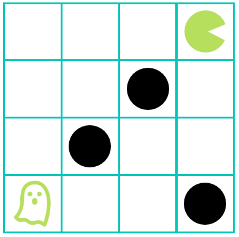

За сите тест примери големината на таблата n се чита од стандарден влез. Потоа се чита бројот на ѕидови и позициите на
секој ѕид. Почетната позиција на Духот секогаш е (0, 0), додека позицијата на Пакман секогаш е (n-1, n-1). Ваша задача е
да го имплементирате движењето на Духот во successor функцијата, така што најпрво ќе се проба акцијата за движење горе,
а потоа десно. Акциите се именуваат како „Gore/desno X“. Потоа имплементирајте ја хевристичката функција h. Состојбата
на проблемот се чува во торка каде што елементите се x и y позициите на Духот. На пример, почетната состојба за дадената
слика би била (0, 0). Потребно е проблемот да се реши во најмал број на чекори со примена на информирано пребарување.
For example:

````
Input	Result
4	    ['Gore 3', 'Desno 3']
3
1,1
2,2
3,0
````

````
Starter code:
import bisect


"""
Дефинирање на класа за структурата на проблемот кој ќе го решаваме со пребарување.
Класата Problem е апстрактна класа од која правиме наследување за дефинирање на основните 
карактеристики на секој проблем што сакаме да го решиме
"""


class Problem:
    def __init__(self, initial, goal=None):
        self.initial = initial
        self.goal = goal

    def successor(self, state):
        """За дадена состојба, врати речник од парови {акција : состојба}
        достапни од оваа состојба. Ако има многу следбеници, употребете
        итератор кој би ги генерирал следбениците еден по еден, наместо да
        ги генерирате сите одеднаш.

        :param state: дадена состојба
        :return:  речник од парови {акција : состојба} достапни од оваа
                  состојба
        :rtype: dict
        """
        raise NotImplementedError

    def actions(self, state):
        """За дадена состојба state, врати листа од сите акции што може да
        се применат над таа состојба

        :param state: дадена состојба
        :return: листа на акции
        :rtype: list
        """
        raise NotImplementedError

    def result(self, state, action):
        """За дадена состојба state и акција action, врати ја состојбата
        што се добива со примена на акцијата над состојбата

        :param state: дадена состојба
        :param action: дадена акција
        :return: резултантна состојба
        """
        raise NotImplementedError

    def goal_test(self, state):
        """Врати True ако state е целна состојба. Даденава имплементација
        на методот директно ја споредува state со self.goal, како што е
        специфицирана во конструкторот. Имплементирајте го овој метод ако
        проверката со една целна состојба self.goal не е доволна.

        :param state: дадена состојба
        :return: дали дадената состојба е целна состојба
        :rtype: bool
        """
        return state == self.goal

    def path_cost(self, c, state1, action, state2):
        """Врати ја цената на решавачкиот пат кој пристигнува во состојбата
        state2 од состојбата state1 преку акцијата action, претпоставувајќи
        дека цената на патот до состојбата state1 е c. Ако проблемот е таков
        што патот не е важен, оваа функција ќе ја разгледува само состојбата
        state2. Ако патот е важен, ќе ја разгледува цената c и можеби и
        state1 и action. Даденава имплементација му доделува цена 1 на секој
        чекор од патот.

        :param c: цена на патот до состојбата state1
        :param state1: дадена моментална состојба
        :param action: акција која треба да се изврши
        :param state2: состојба во која треба да се стигне
        :return: цена на патот по извршување на акцијата
        :rtype: float
        """
        return c + 1

    def value(self):
        """За проблеми на оптимизација, секоја состојба си има вредност. 
        Hill-climbing и сличните алгоритми се обидуваат да ја максимизираат
        оваа вредност.

        :return: вредност на состојба
        :rtype: float
        """
        raise NotImplementedError


"""
Дефинирање на класата за структурата на јазел од пребарување.
Класата Node не се наследува
"""


class Node:
    def __init__(self, state, parent=None, action=None, path_cost=0):
        """Креирај јазол од пребарувачкото дрво, добиен од parent со примена
        на акцијата action

        :param state: моментална состојба (current state)
        :param parent: родителска состојба (parent state)
        :param action: акција (action)
        :param path_cost: цена на патот (path cost)
        """
        self.state = state
        self.parent = parent
        self.action = action
        self.path_cost = path_cost
        self.depth = 0  # search depth
        if parent:
            self.depth = parent.depth + 1

    def __repr__(self):
        return "<Node %s>" % (self.state,)

    def __lt__(self, node):
        return self.state < node.state

    def expand(self, problem):
        """Излистај ги јазлите достапни во еден чекор од овој јазол.

        :param problem: даден проблем
        :return: листа на достапни јазли во еден чекор
        :rtype: list(Node)
        """

        return [self.child_node(problem, action)
                for action in problem.actions(self.state)]

    def child_node(self, problem, action):
        """Дете јазел

        :param problem: даден проблем
        :param action: дадена акција
        :return: достапен јазел според дадената акција
        :rtype: Node
        """
        next_state = problem.result(self.state, action)
        return Node(next_state, self, action,
                    problem.path_cost(self.path_cost, self.state,
                                      action, next_state))

    def solution(self):
        """Врати ја секвенцата од акции за да се стигне од коренот до овој јазол.

        :return: секвенцата од акции
        :rtype: list
        """
        return [node.action for node in self.path()[1:]]

    def solve(self):
        """Врати ја секвенцата од состојби за да се стигне од коренот до овој јазол.

        :return: листа од состојби
        :rtype: list
        """
        return [node.state for node in self.path()[0:]]

    def path(self):
        """Врати ја листата од јазли што го формираат патот од коренот до овој јазол.

        :return: листа од јазли од патот
        :rtype: list(Node)
        """
        x, result = self, []
        while x:
            result.append(x)
            x = x.parent
        result.reverse()
        return result

    """Сакаме редицата од јазли кај breadth_first_search или 
    astar_search да не содржи состојби - дупликати, па јазлите што
    содржат иста состојба ги третираме како исти. [Проблем: ова може
    да не биде пожелно во други ситуации.]"""

    def __eq__(self, other):
        return isinstance(other, Node) and self.state == other.state

    def __hash__(self):
        return hash(self.state)


"""
Дефинирање на помошни структури за чување на листата на генерирани, но непроверени јазли
"""


class Queue:
    """Queue е апстрактна класа / интерфејс. Постојат 3 типа:
    Stack(): Last In First Out Queue (стек).
    FIFOQueue(): First In First Out Queue (редица).
    PriorityQueue(order, f): Queue во сортиран редослед (подразбирливо,од најмалиот кон најголемиот јазол).
    """

    def __init__(self):
        raise NotImplementedError

    def append(self, item):
        """Додади го елементот item во редицата

        :param item: даден елемент
        :return: None
        """
        raise NotImplementedError

    def extend(self, items):
        """Додади ги елементите items во редицата

        :param items: дадени елементи
        :return: None
        """
        raise NotImplementedError

    def pop(self):
        """Врати го првиот елемент од редицата

        :return: прв елемент
        """
        raise NotImplementedError

    def __len__(self):
        """Врати го бројот на елементи во редицата

        :return: број на елементи во редицата
        :rtype: int
        """
        raise NotImplementedError

    def __contains__(self, item):
        """Проверка дали редицата го содржи елементот item

        :param item: даден елемент
        :return: дали queue го содржи item
        :rtype: bool
        """
        raise NotImplementedError


class Stack(Queue):
    """Last-In-First-Out Queue."""

    def __init__(self):
        self.data = []

    def append(self, item):
        self.data.append(item)

    def extend(self, items):
        self.data.extend(items)

    def pop(self):
        return self.data.pop()

    def __len__(self):
        return len(self.data)

    def __contains__(self, item):
        return item in self.data


class FIFOQueue(Queue):
    """First-In-First-Out Queue."""

    def __init__(self):
        self.data = []

    def append(self, item):
        self.data.append(item)

    def extend(self, items):
        self.data.extend(items)

    def pop(self):
        return self.data.pop(0)

    def __len__(self):
        return len(self.data)

    def __contains__(self, item):
        return item in self.data


class PriorityQueue(Queue):
    """Редица во која прво се враќа минималниот (или максималниот) елемент
    (како што е определено со f и order). Оваа структура се користи кај
    информирано пребарување"""
    """"""

    def __init__(self, order=min, f=lambda x: x):
        """
        :param order: функција за подредување, ако order е min, се враќа елементот
                      со минимална f(x); ако order е max, тогаш се враќа елементот
                      со максимална f(x).
        :param f: функција f(x)
        """
        assert order in [min, max]
        self.data = []
        self.order = order
        self.f = f

    def append(self, item):
        bisect.insort_right(self.data, (self.f(item), item))

    def extend(self, items):
        for item in items:
            bisect.insort_right(self.data, (self.f(item), item))

    def pop(self):
        if self.order == min:
            return self.data.pop(0)[1]
        return self.data.pop()[1]

    def __len__(self):
        return len(self.data)

    def __contains__(self, item):
        return any(item == pair[1] for pair in self.data)

    def __getitem__(self, key):
        for _, item in self.data:
            if item == key:
                return item

    def __delitem__(self, key):
        for i, (value, item) in enumerate(self.data):
            if item == key:
                self.data.pop(i)


from sys import maxsize as infinity

"""
Информирано пребарување во рамки на граф
"""


def memoize(fn, slot=None):
    """ Запамети ја пресметаната вредност за која била листа од
    аргументи. Ако е специфициран slot, зачувај го резултатот во
    тој slot на првиот аргумент. Ако slot е None, зачувај ги
    резултатите во речник.

    :param fn: зададена функција
    :type fn: function
    :param slot: име на атрибут во кој се чуваат резултатите од функцијата
    :type slot: str
    :return: функција со модификација за зачувување на резултатите
    :rtype: function
    """
    if slot:
        def memoized_fn(obj, *args):
            if hasattr(obj, slot):
                return getattr(obj, slot)
            else:
                val = fn(obj, *args)
                setattr(obj, slot, val)
                return val
    else:
        def memoized_fn(*args):
            if args not in memoized_fn.cache:
                memoized_fn.cache[args] = fn(*args)
            return memoized_fn.cache[args]

        memoized_fn.cache = {}
    return memoized_fn


def best_first_graph_search(problem, f):
    """Пребарувај низ следбениците на даден проблем за да најдеш цел. Користи
     функција за евалуација за да се одлучи кој е сосед најмногу ветува и
     потоа да се истражи. Ако до дадена состојба стигнат два пата, употреби
     го најдобриот пат.

    :param problem: даден проблем
    :type problem: Problem
    :param f: дадена функција за евалуација (проценка)
    :type f: function
    :return: Node or None
    :rtype: Node
    """
    f = memoize(f, 'f')
    node = Node(problem.initial)
    if problem.goal_test(node.state):
        return node
    frontier = PriorityQueue(min, f)
    frontier.append(node)
    explored = set()
    while frontier:
        node = frontier.pop()
        if problem.goal_test(node.state):
            return node
        explored.add(node.state)
        for child in node.expand(problem):
            if child.state not in explored and child not in frontier:
                frontier.append(child)
            elif child in frontier:
                incumbent = frontier[child]
                if f(child) < f(incumbent):
                    del frontier[incumbent]
                    frontier.append(child)
    return None


def greedy_best_first_graph_search(problem, h=None):
    """ Greedy best-first пребарување се остварува ако се специфицира дека f(n) = h(n).

    :param problem: даден проблем
    :type problem: Problem
    :param h: дадена функција за хевристика
    :type h: function
    :return: Node or None
    """
    h = memoize(h or problem.h, 'h')
    return best_first_graph_search(problem, h)


def astar_search(problem, h=None):
    """ A* пребарување е best-first graph пребарување каде f(n) = g(n) + h(n).

    :param problem: даден проблем
    :type problem: Problem
    :param h: дадена функција за хевристика
    :type h: function
    :return: Node or None
    """
    h = memoize(h or problem.h, 'h')
    return best_first_graph_search(problem, lambda n: n.path_cost + h(n))


def recursive_best_first_search(problem, h=None):
    """Recursive best first search - ја ограничува рекурзијата
    преку следење на f-вредноста на најдобриот алтернативен пат
    од било кој јазел предок (еден чекор гледање нанапред).

    :param problem: даден проблем
    :type problem: Problem
    :param h: дадена функција за хевристика
    :type h: function
    :return: Node or None
    """
    h = memoize(h or problem.h, 'h')

    def RBFS(problem, node, flimit):
        if problem.goal_test(node.state):
            return node, 0  # (втората вредност е неважна)
        successors = node.expand(problem)
        if len(successors) == 0:
            return None, infinity
        for s in successors:
            s.f = max(s.path_cost + h(s), node.f)
        while True:
            # Подреди ги според најниската f вредност
            successors.sort(key=lambda x: x.f)
            best = successors[0]
            if best.f > flimit:
                return None, best.f
            if len(successors) > 1:
                alternative = successors[1].f
            else:
                alternative = infinity
            result, best.f = RBFS(problem, best, min(flimit, alternative))
            if result is not None:
                return result, best.f

    node = Node(problem.initial)
    node.f = h(node)
    result, bestf = RBFS(problem, node, infinity)
    return result
    

class GhostOnSkates(Problem):
    def __init__(self, initial, walls, n, goal=None):
        super().__init__(initial, goal)
        self.walls = walls
        self.n = n

    def actions(self, state):
        return self.successor(state).keys()

    def result(self, state, action):
        return self.successor(state)[action]

    def goal_test(self, state):
        return state == self.goal

    @staticmethod
    def check_valid(state, walls, n):
        ...

    def successor(self, state):
        successors = dict()

        ...

        return successors

    def h(self, node):
        ...


if __name__ == '__main__':
    n = int(input())
    ghost_pos = (0, 0)
    goal_pos = (n - 1, n - 1)

    num_holes = int(input())
    holes = list()
    for _ in range(num_holes):
        holes.append(tuple(map(int, input().split(','))))

    problem = GhostOnSkates(ghost_pos, holes, n, goal_pos)
````

## Задача 2 - crypto_puzzle

**SEND+MORE=MONEY** е криптоаритметичка загатка, што значи дека станува збор за наоѓање цифри кои ги заменуваат буквите
за да се направи математичкиот израз вистинит. Секоја буква во проблемот претставува една цифра (0–9). Две букви не
можат да ја претставуваат истата цифра. Кога буквата се повторува, тоа значи дека цифрата се повторува во решението.

````
	S	E	N	D
+	M	O	R	E
==================================
M	O	N	E	Y
````

Даден е почетен код со кој е креирана класа за претставување на проблемот, на кој се додадени променливите со нивниот
домен. Потоа се повикува наоѓање на решение со BacktrackingSolver. Ваша задача е да го/ги додадете ограничувањето/њата (
условите) на проблемот.

**Потсетник:** Во дадениот модул constraint веќе се имплементирани следните ограничувања како класи:
AllDifferentConstraint, AllEqualConstraint, MaxSumConstraint, ExactSumConstraint, MinSumConstraint, InSetConstraint,
NotInSetConstraint, SomeInSetConstraint, SomeNotInSetConstraint.

````
For example:
Result
{'D': 9, 'E': 8, 'M': 0, 'N': 1, 'O': 3, 'R': 6, 'S': 2, 'Y': 7}
````

````
Starter code:
from constraint import *

if __name__ == '__main__':
    problem = Problem(BacktrackingSolver())
    variables = ["S", "E", "N", "D", "M", "O", "R", "Y"]
    for variable in variables:
        problem.addVariable(variable, Domain(set(range(10))))
    
    # ---Tuka dodadete gi ogranichuvanjata----------------
    
    # ----------------------------------------------------
    
    print(problem.getSolution())
````

## Задача 3 - hanoi

Во серија се наредени N кружни столбови со иста висина. На почетокот, на само еден од столбовите наредени се M камени
блокови во форма на крофни со различна големина. Блоковите се наредени како кула т.н. најголемиот блок е поставен
најдоле на столбот, а секој блок после него е помал од својот претходник подолу.

Крајната цел е кулата од почетниот столб да се премести на некој друг столб т.ш. ќе биде запазен оригиналниот редослед
на блоковите.

Слика: hanoi.jpg

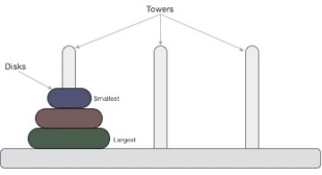

Ваша задача е преку техниката на неинформирано пребарување низ простор на состојби да одредите кој е најмалиот број на
чекори потребни да се пресметат блоковите од почетниот столб до крајниот т.ш. важи правилото дека во секој чекор само
еден блок од врвот на некој столб може да се помести на некој друг столб ако е помал од блокот на врвот на другиот столб
или другиот столб е празен. Во почетниот код дадено ви е читањето од стандарден влез на почетната и целната состојба на
столбовите, т.ш. секој столб е претставен со посебна торка а броевите ги означуваат големините на блоковите. На
стандарден излез испечатете го минималниот број на потребни чекори да се реши проблемот како и редоследот на потребните
акции кои се во форматот MOVE TOP BLOCK FROM PILLAR i TO PILLAR j.

````
For example:
Input
3,2,1;;
;;3,2,1

Result
Number of action 7
['MOVE TOP BLOCK FROM PILLAR 1 TO PILLAR 3', 'MOVE TOP BLOCK FROM PILLAR 1 TO PILLAR 2', 'MOVE TOP BLOCK FROM PILLAR 3 TO PILLAR 2', 'MOVE TOP BLOCK FROM PILLAR 1 TO PILLAR 3', 'MOVE TOP BLOCK FROM PILLAR 2 TO PILLAR 1', 'MOVE TOP BLOCK FROM PILLAR 2 TO PILLAR 3', 'MOVE TOP BLOCK FROM PILLAR 1 TO PILLAR 3']
====================
Input
;;4,3,2,1
;4,3,2,1;

Result
Number of action 15
['MOVE TOP BLOCK FROM PILLAR 3 TO PILLAR 1', 'MOVE TOP BLOCK FROM PILLAR 3 TO PILLAR 2', 'MOVE TOP BLOCK FROM PILLAR 1 TO PILLAR 2', 'MOVE TOP BLOCK FROM PILLAR 3 TO PILLAR 1', 'MOVE TOP BLOCK FROM PILLAR 2 TO PILLAR 3', 'MOVE TOP BLOCK FROM PILLAR 2 TO PILLAR 1', 'MOVE TOP BLOCK FROM PILLAR 3 TO PILLAR 1', 'MOVE TOP BLOCK FROM PILLAR 3 TO PILLAR 2', 'MOVE TOP BLOCK FROM PILLAR 1 TO PILLAR 2', 'MOVE TOP BLOCK FROM PILLAR 1 TO PILLAR 3', 'MOVE TOP BLOCK FROM PILLAR 2 TO PILLAR 3', 'MOVE TOP BLOCK FROM PILLAR 1 TO PILLAR 2', 'MOVE TOP BLOCK FROM PILLAR 3 TO PILLAR 1', 'MOVE TOP BLOCK FROM PILLAR 3 TO PILLAR 2', 'MOVE TOP BLOCK FROM PILLAR 1 TO PILLAR 2']
====================
Input
6,5,4,3,2,1;;
;;6,5,4,3,2,1

Result
Number of action 63
['MOVE TOP BLOCK FROM PILLAR 1 TO PILLAR 2', 'MOVE TOP BLOCK FROM PILLAR 1 TO PILLAR 3', 'MOVE TOP BLOCK FROM PILLAR 2 TO PILLAR 3', 'MOVE TOP BLOCK FROM PILLAR 1 TO PILLAR 2', 'MOVE TOP BLOCK FROM PILLAR 3 TO PILLAR 1', 'MOVE TOP BLOCK FROM PILLAR 3 TO PILLAR 2', 'MOVE TOP BLOCK FROM PILLAR 1 TO PILLAR 2', 'MOVE TOP BLOCK FROM PILLAR 1 TO PILLAR 3', 'MOVE TOP BLOCK FROM PILLAR 2 TO PILLAR 3', 'MOVE TOP BLOCK FROM PILLAR 2 TO PILLAR 1', 'MOVE TOP BLOCK FROM PILLAR 3 TO PILLAR 1', 'MOVE TOP BLOCK FROM PILLAR 2 TO PILLAR 3', 'MOVE TOP BLOCK FROM PILLAR 1 TO PILLAR 2', 'MOVE TOP BLOCK FROM PILLAR 1 TO PILLAR 3', 'MOVE TOP BLOCK FROM PILLAR 2 TO PILLAR 3', 'MOVE TOP BLOCK FROM PILLAR 1 TO PILLAR 2', 'MOVE TOP BLOCK FROM PILLAR 3 TO PILLAR 1', 'MOVE TOP BLOCK FROM PILLAR 3 TO PILLAR 2', 'MOVE TOP BLOCK FROM PILLAR 1 TO PILLAR 2', 'MOVE TOP BLOCK FROM PILLAR 3 TO PILLAR 1', 'MOVE TOP BLOCK FROM PILLAR 2 TO PILLAR 3', 'MOVE TOP BLOCK FROM PILLAR 2 TO PILLAR 1', 'MOVE TOP BLOCK FROM PILLAR 3 TO PILLAR 1', 'MOVE TOP BLOCK FROM PILLAR 3 TO PILLAR 2', 'MOVE TOP BLOCK FROM PILLAR 1 TO PILLAR 2', 'MOVE TOP BLOCK FROM PILLAR 1 TO PILLAR 3', 'MOVE TOP BLOCK FROM PILLAR 2 TO PILLAR 3', 'MOVE TOP BLOCK FROM PILLAR 1 TO PILLAR 2', 'MOVE TOP BLOCK FROM PILLAR 3 TO PILLAR 1', 'MOVE TOP BLOCK FROM PILLAR 3 TO PILLAR 2', 'MOVE TOP BLOCK FROM PILLAR 1 TO PILLAR 2', 'MOVE TOP BLOCK FROM PILLAR 1 TO PILLAR 3', 'MOVE TOP BLOCK FROM PILLAR 2 TO PILLAR 3', 'MOVE TOP BLOCK FROM PILLAR 2 TO PILLAR 1', 'MOVE TOP BLOCK FROM PILLAR 3 TO PILLAR 1', 'MOVE TOP BLOCK FROM PILLAR 2 TO PILLAR 3', 'MOVE TOP BLOCK FROM PILLAR 1 TO PILLAR 2', 'MOVE TOP BLOCK FROM PILLAR 1 TO PILLAR 3', 'MOVE TOP BLOCK FROM PILLAR 2 TO PILLAR 3', 'MOVE TOP BLOCK FROM PILLAR 2 TO PILLAR 1', 'MOVE TOP BLOCK FROM PILLAR 3 TO PILLAR 1', 'MOVE TOP BLOCK FROM PILLAR 3 TO PILLAR 2', 'MOVE TOP BLOCK FROM PILLAR 1 TO PILLAR 2', 'MOVE TOP BLOCK FROM PILLAR 3 TO PILLAR 1', 'MOVE TOP BLOCK FROM PILLAR 2 TO PILLAR 3', 'MOVE TOP BLOCK FROM PILLAR 2 TO PILLAR 1', 'MOVE TOP BLOCK FROM PILLAR 3 TO PILLAR 1', 'MOVE TOP BLOCK FROM PILLAR 2 TO PILLAR 3', 'MOVE TOP BLOCK FROM PILLAR 1 TO PILLAR 2', 'MOVE TOP BLOCK FROM PILLAR 1 TO PILLAR 3', 'MOVE TOP BLOCK FROM PILLAR 2 TO PILLAR 3', 'MOVE TOP BLOCK FROM PILLAR 1 TO PILLAR 2', 'MOVE TOP BLOCK FROM PILLAR 3 TO PILLAR 1', 'MOVE TOP BLOCK FROM PILLAR 3 TO PILLAR 2', 'MOVE TOP BLOCK FROM PILLAR 1 TO PILLAR 2', 'MOVE TOP BLOCK FROM PILLAR 1 TO PILLAR 3', 'MOVE TOP BLOCK FROM PILLAR 2 TO PILLAR 3', 'MOVE TOP BLOCK FROM PILLAR 2 TO PILLAR 1', 'MOVE TOP BLOCK FROM PILLAR 3 TO PILLAR 1', 'MOVE TOP BLOCK FROM PILLAR 2 TO PILLAR 3', 'MOVE TOP BLOCK FROM PILLAR 1 TO PILLAR 2', 'MOVE TOP BLOCK FROM PILLAR 1 TO PILLAR 3', 'MOVE TOP BLOCK FROM PILLAR 2 TO PILLAR 3']
====================
Input
;6,5,4,3,2,1;;
;;6,5,4,3,2,1;

Result
Number of action 17
['MOVE TOP BLOCK FROM PILLAR 2 TO PILLAR 1', 'MOVE TOP BLOCK FROM PILLAR 2 TO PILLAR 3', 'MOVE TOP BLOCK FROM PILLAR 2 TO PILLAR 4', 'MOVE TOP BLOCK FROM PILLAR 3 TO PILLAR 4', 'MOVE TOP BLOCK FROM PILLAR 1 TO PILLAR 4', 'MOVE TOP BLOCK FROM PILLAR 2 TO PILLAR 3', 'MOVE TOP BLOCK FROM PILLAR 2 TO PILLAR 1', 'MOVE TOP BLOCK FROM PILLAR 3 TO PILLAR 1', 'MOVE TOP BLOCK FROM PILLAR 2 TO PILLAR 3', 'MOVE TOP BLOCK FROM PILLAR 1 TO PILLAR 2', 'MOVE TOP BLOCK FROM PILLAR 1 TO PILLAR 3', 'MOVE TOP BLOCK FROM PILLAR 2 TO PILLAR 3', 'MOVE TOP BLOCK FROM PILLAR 4 TO PILLAR 1', 'MOVE TOP BLOCK FROM PILLAR 4 TO PILLAR 2', 'MOVE TOP BLOCK FROM PILLAR 4 TO PILLAR 3', 'MOVE TOP BLOCK FROM PILLAR 2 TO PILLAR 3', 'MOVE TOP BLOCK FROM PILLAR 1 TO PILLAR 3']
====================
Input
;6,6,4,4,2,2;;
;;6,6,4,4,2,2;

Result
Number of action 10
['MOVE TOP BLOCK FROM PILLAR 2 TO PILLAR 1', 'MOVE TOP BLOCK FROM PILLAR 2 TO PILLAR 1', 'MOVE TOP BLOCK FROM PILLAR 2 TO PILLAR 4', 'MOVE TOP BLOCK FROM PILLAR 2 TO PILLAR 4', 'MOVE TOP BLOCK FROM PILLAR 2 TO PILLAR 3', 'MOVE TOP BLOCK FROM PILLAR 2 TO PILLAR 3', 'MOVE TOP BLOCK FROM PILLAR 4 TO PILLAR 3', 'MOVE TOP BLOCK FROM PILLAR 4 TO PILLAR 3', 'MOVE TOP BLOCK FROM PILLAR 1 TO PILLAR 3', 'MOVE TOP BLOCK FROM PILLAR 1 TO PILLAR 3']
````

## Задача 4 - timetable

Потребно е да се направи распоред на часови за една група студенти. Студентите слушаат 4 предмети: Вештачка
интелигенција (AI), Машинско учење (ML), Роботика (R) и Биоинформатика (BI). За секој предмет треба да се закажат
термини за предавања и вежби. Бројот на термини за предавања за секој предмет се прима на влез. Бројот на термини за
вежби е секогаш 1 (ако за тој предмет има вежби). Еден термин трае 2 часа. Почетокот на терминот може да биде на секој
час, односно терминот може да почне во 12:00, но не во 12:05, 12:10 итн. За секој од предметите дадени се времињата во
кои може да се одржат (дадено е времето на можен почеток на терминот):

- Вештачка интелигенција (предавања): понеделник, среда, петок во 11:00 и 12:00 часот
- Вештачка интелигенција (вежби): вторник и четврток во 10:00, 11:00, 12:00 и 13:00 часот
- Машинско учење (предавања): понеделник, среда, петок во 12:00, 13:00 и 15:00 часот
- Машинско учење (вежби): вторник и четврток во 11:00, 13:00 и 14:00 часот
- Роботика (предавања): понеделник, среда, петок во 10:00, 11:00, 12:00, 13:00, 14:00 и 15:00 часот
- Роботика (вежби): нема
- Биоинформатика (предавања): понеделник, среда, петок во 10:00 и 11:00 часот
- Биоинформатика (вежби): вторник и четврток во 10:00 и 11:00 часот

За термините важат следните ограничувања:

- Не смее да има преклопување на термините
- Предавањата и вежбите за Машинско учење мора да почнуваат во различно време (пр. ако има час во понделник кој почнува
  во 12 часот, тогаш не смее да има термин по Машинско учење кој почнува во 12 другите денови)
- Доколу има повеќе часови по некој предмет, не мора час 1 да доаѓа пред час 2.

Даден е почетен код со кој е креирана класа за претставување на проблемот и домените на променливите. Потоа се повикува
наоѓање на решение со BacktrackingSolver. Ваша задача е да ги дефинирате променливите, како и да ги додадете
ограничувањата (условите) на проблемот.

**Потсетник:** Во дадениот модул constraint веќе се имплементирани следните ограничувања како класи:
AllDifferentConstraint, AllEqualConstraint, MaxSumConstraint, ExactSumConstraint, MinSumConstraint, InSetConstraint,
NotInSetConstraint, SomeInSetConstraint, SomeNotInSetConstraint.

````
For example:
Input
1
1
1
1
Result
{'ML_vezbi': 'Thu_14', 'ML_cas_1': 'Fri_15', 'BI_vezbi': 'Thu_11', 'AI_vezbi': 'Tue_13', 'AI_cas_1': 'Fri_12', 'BI_cas_1': 'Fri_10', 'R_cas_1': 'Wed_15'}
````

````
Starter code:
from constraint import *

if __name__ == '__main__':
    problem = Problem(BacktrackingSolver())
    casovi_AI = input()
    casovi_ML = input()
    casovi_R = input()
    casovi_BI = input()
   
    AI_predavanja_domain = ["Mon_11", "Mon_12", "Wed_11", "Wed_12", "Fri_11", "Fri_12"]
    ML_predavanja_domain = ["Mon_12", "Mon_13", "Mon_15", "Wed_12", "Wed_13", "Wed_15", "Fri_11", "Fri_12", "Fri_15"]
    R_predavanja_domain = ["Mon_10", "Mon_11", "Mon_12", "Mon_13","Mon_14", "Mon_15", "Wed_10", "Wed_11", "Wed_12", "Wed_13","Wed_14", "Wed_15", "Fri_10", "Fri_11", "Fri_12", "Fri_13","Fri_14", "Fri_15"]
    BI_predavanja_domain = ["Mon_10", "Mon_11", "Wed_10", "Wed_11", "Fri_10", "Fri_11"]
    
    AI_vezbi_domain = ["Tue_10", "Tue_11", "Tue_12", "Tue_13", "Thu_10", "Thu_11", "Thu_12", "Thu_13"]
    ML_vezbi_domain = ["Tue_11", "Tue_13", "Tue_14", "Thu_11", "Thu_13", "Thu_14"]
    BI_vezbi_domain = ["Tue_10", "Tue_11", "Thu_10", "Thu_11"]
    
    # ---Tuka dodadete gi promenlivite--------------------
    
    # ---Tuka dodadete gi ogranichuvanjata----------------
    # ----------------------------------------------------
    solution = problem.getSolution()
    
    print(solution)
````

## Задача 5 - gray_squares_uninformed

Дадена е табла 5x5, каде што се поставени 5 сиви квадратчиња. На почетокот 5те квадратчиња се поставени на случајни
позиции во таблата. Секое од квадратчињата има реден број, кој што одредува на кое поле по левата дијагонала на таблата
е потребно да се намести даденото квадратче. Пример на почетна состојба на таблата е даден на слика 1, додека слика 2 ја
прикажува состојбата на таблата која е целна. Секое од квадратчињата може да се помести во четири насоки: горе, долу,
лево и десно за една позиција. Со еден потег може да се помести само едно црно квадратче, и притоа квадратчето не смее
да се помести надвор од таблата, а на едно исто поле може да се најдат повеќе квадратчиња.

Слика 1: state1.png

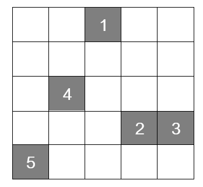

Слика 2: state2.png

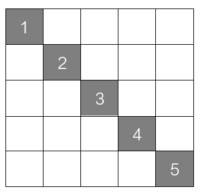

За сите тест примери големината на таблата е иста, а позицијата на секоја од квадратчињата се чита од стандарден влез.
Ваша задача е да го имплементирате поместувањето на квадратчињата во successor функцијата, така што најпрво ќе се проба
акцијата за поместување на првото квадратче горе, долу, лево и десно, потоа на второто, третото, четвртото и петтото по
тој редослед. Акциите се именуваат како „Pomesti kvadratche X levo/desno/gore/dolu“. Проверката дали состојбата е
валидна е веќе имплементирана со функцијата check_valid и може да си ја искористите директно, не треба ништо друго да
имплементирате! Состојбата на проблемот се чува во торка каде што елементите се x и y позициите на секое од
квадратчињата, претставени редоследно според бројот кој го претставуваат (на прва позиција е квадратчето со број 1, на
втора позција е квадратчето со број 2, итн.). На пример, почетната состојба на слика 1 би била ((2, 4), (3, 1), (4,
1), (1, 2), (0, 0)).

````
For example:
Input
2,4
1,3
2,2
3,1
4,0

Result
['Pomesti kvadratche 1 levo', 'Pomesti kvadratche 1 levo']
====================
Input
2,4
0,3
2,1
3,1
4,0

Expected
['Pomesti kvadratche 1 levo', 'Pomesti kvadratche 1 levo', 'Pomesti kvadratche 2 desno', 'Pomesti kvadratche 3 gore']
====================
Input
0,4
1,3
2,2
3,1
4,0

Expected
[]
====================
Input
1,3
0,4
2,2
3,0
4,0

Expected
['Pomesti kvadratche 1 gore', 'Pomesti kvadratche 1 levo', 'Pomesti kvadratche 2 dolu', 'Pomesti kvadratche 2 desno', 'Pomesti kvadratche 4 gore']
====================put
0,2
0,4
2,2
3,1
4,0

Expected
['Pomesti kvadratche 1 gore', 'Pomesti kvadratche 1 gore', 'Pomesti kvadratche 2 dolu', 'Pomesti kvadratche 2 desno']
````

## Задача 6 - gray_squares_informed

Дадена е табла 5x5, каде што се поставени 5 сиви квадратчиња. На почетокот 5те квадратчиња се поставени на случајни
позиции во таблата. Секое од квадратчињата има реден број, кој што одредува на кое поле по левата дијагонала на таблата
е потребно да се намести даденото квадратче. Пример на почетна состојба на таблата е даден на слика 1, додека слика 2 ја
прикажува состојбата на таблата која е целна. Секое од квадратчињата може да се помести во четири насоки: горе, долу,
лево и десно за една позиција. Со еден потег може да се помести само едно црно квадратче, и притоа квадратчето не смее
да се помести надвор од таблата, а на едно исто поле може да се најдат повеќе квадратчиња.

Слика 1: state1.png


Слика 2: state2.png


За сите тест примери големината на таблата е иста, а позицијата на секоја од квадратчињата се чита од стандарден влез.
Ваша задача е да ја имплементирате хевристичката функција h во класата Squares. Сите останати функции (sucessor,
goal_test, actions, result) претпоставете дека се имплементирани во позадина. Освен хевристичката функција, не
имплементирајте ништо друго!!! Состојбата на проблемот се чува во торка каде што елементите се x и y позициите на секое
од квадратчињата, претставени редоследно според бројот кој го претставуваат (на прва позиција е квадратчето со број 1,
на втора позција е квадратчето со број 2, итн.). На пример, почетната состојба на слика 1 би била ((2, 4), (3, 1), (4,
1), (1, 2), (0, 0)).

````
Starter code:
import bisect

"""
Defining a class for the problem structure that we will solve with a search.
The Problem class is an abstract class from which we make inheritance to define the basic
characteristics of every problem we want to solve
"""


class Problem:
    def __init__(self, initial, goal=None):
        self.initial = initial
        self.goal = goal

    def successor(self, state):
        """Given a state, return a dictionary of {action : state} pairs reachable
        from this state. If there are many successors, consider an iterator
        that yields the successors one at a time, rather than building them
        all at once.

        :param state: given state
        :return:  dictionary of {action : state} pairs reachable
                  from this state
        :rtype: dict
        """
        raise NotImplementedError

    def actions(self, state):
        """Given a state, return a list of all actions possible
        from that state

        :param state: given state
        :return: list of actions
        :rtype: list
        """
        raise NotImplementedError

    def result(self, state, action):
        """Given a state and action, return the resulting state

        :param state: given state
        :param action: given action
        :return: resulting state
        """
        raise NotImplementedError

    def goal_test(self, state):
        """Return True if the state is a goal. The default method compares
        the state to self.goal, as specified in the constructor. Implement
        this method if checking against a single self.goal is not enough.

        :param state: given state
        :return: is the given state a goal state
        :rtype: bool
        """
        return state == self.goal

    def path_cost(self, c, state1, action, state2):
        """Return the cost of a solution path that arrives at state2 from state1
        via action, assuming cost c to get up to state1. If the problem is such
        that the path doesn't matter, this function will only look at state2.
        If the path does matter, it will consider c and maybe state1 and action.
        The default method costs 1 for every step in the path.

        :param c: cost of the path to get up to state1
        :param state1: given current state
        :param action: action that needs to be done
        :param state2: state to arrive to
        :return: cost of the path after executing the action
        :rtype: float
        """
        return c + 1

    def value(self):
        """For optimization problems, each state has a value.
        Hill-climbing and related algorithms try to maximize this value.

        :return: state value
        :rtype: float
        """
        raise NotImplementedError


"""
Definition of the class for node structure of the search.
The class Node is not inherited
"""


class Node:
    def __init__(self, state, parent=None, action=None, path_cost=0):
        """Create node from the search tree,  obtained from the parent by
        taking the action

        :param state: current state
        :param parent: parent state
        :param action: action
        :param path_cost: path cost
        """
        self.state = state
        self.parent = parent
        self.action = action
        self.path_cost = path_cost
        self.depth = 0  # search depth
        if parent:
            self.depth = parent.depth + 1

    def __repr__(self):
        return "<Node %s>" % (self.state,)

    def __lt__(self, node):
        return self.state < node.state

    def expand(self, problem):
        """List the nodes reachable in one step from this node.

        :param problem: given problem
        :return: list of available nodes in one step
        :rtype: list(Node)
        """
        return [self.child_node(problem, action)
                for action in problem.actions(self.state)]

    def child_node(self, problem, action):
        """Return a child node from this node

        :param problem: given problem
        :param action: given action
        :return: available node  according to the given action
        :rtype: Node
        """
        next_state = problem.result(self.state, action)
        return Node(next_state, self, action,
                    problem.path_cost(self.path_cost, self.state,
                                      action, next_state))

    def solution(self):
        """Return the sequence of actions to go from the root to this node.

        :return: sequence of actions
        :rtype: list
        """
        return [node.action for node in self.path()[1:]]

    def solve(self):
        """Return the sequence of states to go from the root to this node.

        :return: list of states
        :rtype: list
        """
        return [node.state for node in self.path()[0:]]

    def path(self):
        """Return a list of nodes forming the path from the root to this node.

        :return: list of states from the path
        :rtype: list(Node)
        """
        x, result = self, []
        while x:
            result.append(x)
            x = x.parent
        result.reverse()
        return result

    """We want the queue of nodes at breadth_first_search or
    astar_search to not contain states-duplicates, so the nodes that
    contain the same condition we treat as the same. [Problem: this can
    not be desirable in other situations.]"""

    def __eq__(self, other):
        return isinstance(other, Node) and self.state == other.state

    def __hash__(self):
        return hash(self.state)


"""
Definitions of helper structures for storing the list of generated, but not checked nodes
"""


class Queue:
    """Queue is an abstract class/interface. There are three types:
        Stack(): Last In First Out Queue (stack).
        FIFOQueue(): First In First Out Queue.
        PriorityQueue(order, f): Queue in sorted order (default min-first).
    """

    def __init__(self):
        raise NotImplementedError

    def append(self, item):
        """Adds the item into the queue

        :param item: given element
        :return: None
        """
        raise NotImplementedError

    def extend(self, items):
        """Adds the items into the queue

        :param items: given elements
        :return: None
        """
        raise NotImplementedError

    def pop(self):
        """Returns the first element of the queue

        :return: first element
        """
        raise NotImplementedError

    def __len__(self):
        """Returns the number of elements in the queue

        :return: number of elements in the queue
        :rtype: int
        """
        raise NotImplementedError

    def __contains__(self, item):
        """Check if the queue contains the element item

        :param item: given element
        :return: whether the queue contains the item
        :rtype: bool
        """
        raise NotImplementedError


class Stack(Queue):
    """Last-In-First-Out Queue."""

    def __init__(self):
        self.data = []

    def append(self, item):
        self.data.append(item)

    def extend(self, items):
        self.data.extend(items)

    def pop(self):
        return self.data.pop()

    def __len__(self):
        return len(self.data)

    def __contains__(self, item):
        return item in self.data


class FIFOQueue(Queue):
    """First-In-First-Out Queue."""

    def __init__(self):
        self.data = []

    def append(self, item):
        self.data.append(item)

    def extend(self, items):
        self.data.extend(items)

    def pop(self):
        return self.data.pop(0)

    def __len__(self):
        return len(self.data)

    def __contains__(self, item):
        return item in self.data


class PriorityQueue(Queue):
    """A queue in which the minimum (or maximum) element is returned first
     (as determined by f and order). This structure is used in
     informed search"""

    def __init__(self, order=min, f=lambda x: x):
        """
        :param order: sorting function, if order is min, returns the element
                      with minimal f (x); if the order is max, then returns the
                      element with maximum f (x).
        :param f: function f(x)
        """
        assert order in [min, max]
        self.data = []
        self.order = order
        self.f = f

    def append(self, item):
        bisect.insort_right(self.data, (self.f(item), item))

    def extend(self, items):
        for item in items:
            bisect.insort_right(self.data, (self.f(item), item))

    def pop(self):
        if self.order == min:
            return self.data.pop(0)[1]
        return self.data.pop()[1]

    def __len__(self):
        return len(self.data)

    def __contains__(self, item):
        return any(item == pair[1] for pair in self.data)

    def __getitem__(self, key):
        for _, item in self.data:
            if item == key:
                return item

    def __delitem__(self, key):
        for i, (value, item) in enumerate(self.data):
            if item == key:
                self.data.pop(i)


"""
Uninformed graph search
The main difference is that here we do not allow loops,
i.e. repetition of states
"""


def graph_search(problem, fringe):
    """Search through the successors of a problem to find a goal.
     If two paths reach a state, only use the best one.

    :param problem: given problem
    :param fringe: empty queue
    :return: Node
    """
    closed = {}
    fringe.append(Node(problem.initial))
    while fringe:
        node = fringe.pop()
        if problem.goal_test(node.state):
            return node
        if node.state not in closed:
            closed[node.state] = True
            fringe.extend(node.expand(problem))
    return None


def breadth_first_graph_search(problem):
    """Search the shallowest nodes in the search tree first.

    :param problem: given problem
    :return: Node
    """
    return graph_search(problem, FIFOQueue())


"""
Информирано пребарување во рамки на граф
"""


def memoize(fn, slot=None):
    """ Запамети ја пресметаната вредност за која била листа од
    аргументи. Ако е специфициран slot, зачувај го резултатот во
    тој slot на првиот аргумент. Ако slot е None, зачувај ги
    резултатите во речник.

    :param fn: зададена функција
    :type fn: function
    :param slot: име на атрибут во кој се чуваат резултатите од функцијата
    :type slot: str
    :return: функција со модификација за зачувување на резултатите
    :rtype: function
    """
    if slot:
        def memoized_fn(obj, *args):
            if hasattr(obj, slot):
                return getattr(obj, slot)
            else:
                val = fn(obj, *args)
                setattr(obj, slot, val)
                return val
    else:
        def memoized_fn(*args):
            if args not in memoized_fn.cache:
                memoized_fn.cache[args] = fn(*args)
            return memoized_fn.cache[args]

        memoized_fn.cache = {}
    return memoized_fn


def best_first_graph_search(problem, f):
    """Пребарувај низ следбениците на даден проблем за да најдеш цел. Користи
     функција за евалуација за да се одлучи кој е сосед најмногу ветува и
     потоа да се истражи. Ако до дадена состојба стигнат два пата, употреби
     го најдобриот пат.

    :param problem: даден проблем
    :type problem: Problem
    :param f: дадена функција за евалуација (проценка)
    :type f: function
    :return: Node or None
    :rtype: Node
    """
    f = memoize(f, 'f')
    node = Node(problem.initial)
    if problem.goal_test(node.state):
        return node
    frontier = PriorityQueue(min, f)
    frontier.append(node)
    explored = set()
    while frontier:
        node = frontier.pop()
        if problem.goal_test(node.state):
            return node
        explored.add(node.state)
        for child in node.expand(problem):
            if child.state not in explored and child not in frontier:
                frontier.append(child)
            elif child in frontier:
                incumbent = frontier[child]
                if f(child) < f(incumbent):
                    del frontier[incumbent]
                    frontier.append(child)
    return None


def greedy_best_first_graph_search(problem, h=None):
    """ Greedy best-first пребарување се остварува ако се специфицира дека f(n) = h(n).

    :param problem: даден проблем
    :type problem: Problem
    :param h: дадена функција за хевристика
    :type h: function
    :return: Node or None
    """
    h = memoize(h or problem.h, 'h')
    return best_first_graph_search(problem, h)


def astar_search(problem, h=None):
    """ A* пребарување е best-first graph пребарување каде f(n) = g(n) + h(n).

    :param problem: даден проблем
    :type problem: Problem
    :param h: дадена функција за хевристика
    :type h: function
    :return: Node or None
    """
    h = memoize(h or problem.h, 'h')
    return best_first_graph_search(problem, lambda n: n.path_cost + h(n))


class Squares(Problem):
    def __init__(self, initial, goal):
        super().__init__(initial, goal)

    def h(self, node):
        raise NotImplementedError


# NE PISHUVAJTE MAIN DEL
````

````
Test
class SquaresP(Squares):
    def __init__(self, initial, goal=None):
        self.initial = initial
        self.goal = goal

    def goal_test(self, state):
        return state == self.goal

    @staticmethod
    def check_valid(state):
        for x, y in state:
            if x < 0 or x > 4 or y < 0 or y > 4:
                return False
        return True

    def successor(self, state):
        succ = {}
        for i in range(5):
            for x_z, y_z, name in ((0, 1, 'gore'), (0, -1, 'dolu'), (-1, 0, 'levo'), (1, 0, 'desno')):
                current_state = list(state)
                current_state[i] = current_state[i][0] + x_z, current_state[i][1] + y_z
                if self.check_valid(current_state):
                    succ[f'Pomesti kvadratche {i + 1} {name}'] = tuple(current_state)
        return succ

    def actions(self, state):
        return self.successor(state).keys()

    def result(self, state, action):
        return self.successor(state)[action]

if __name__ == '__main__':
    # ((x1, y1), (x2, y2), (x3, y3), (x4, y4), (x5, y5))
    initial_state = tuple()
    for _ in range(5):
        initial_state += (tuple(map(int, input().split(','))),)

    goal_state = ((0, 4), (1, 3), (2, 2), (3, 1), (4, 0))

    squares = SquaresP(initial_state, goal_state)
    solution = astar_search(squares)
    print(solution.solution())
    
Input
2,4
1,3
2,2
3,1
4,0

Result
['Pomesti kvadratche 1 levo', 'Pomesti kvadratche 1 levo']
====================
Test
class SquaresP(Squares):
    def __init__(self, initial, goal=None):
        self.initial = initial
        self.goal = goal

    def goal_test(self, state):
        return state == self.goal

    @staticmethod
    def check_valid(state):
        for x, y in state:
            if x < 0 or x > 4 or y < 0 or y > 4:
                return False
        return True

    def successor(self, state):
        succ = {}
        for i in range(5):
            for x_z, y_z, name in ((0, 1, 'gore'), (0, -1, 'dolu'), (-1, 0, 'levo'), (1, 0, 'desno')):
                current_state = list(state)
                current_state[i] = current_state[i][0] + x_z, current_state[i][1] + y_z
                if self.check_valid(current_state):
                    succ[f'Pomesti kvadratche {i + 1} {name}'] = tuple(current_state)
        return succ

    def actions(self, state):
        return self.successor(state).keys()

    def result(self, state, action):
        return self.successor(state)[action]

if __name__ == '__main__':
    # ((x1, y1), (x2, y2), (x3, y3), (x4, y4), (x5, y5))
    initial_state = tuple()
    for _ in range(5):
        initial_state += (tuple(map(int, input().split(','))),)

    goal_state = ((0, 4), (1, 3), (2, 2), (3, 1), (4, 0))

    squares = SquaresP(initial_state, goal_state)
    solution = astar_search(squares)
    print(solution.solution())
    
Input
2,4
0,3
2,1
3,1
4,0

Result
['Pomesti kvadratche 1 levo', 'Pomesti kvadratche 1 levo', 'Pomesti kvadratche 3 gore', 'Pomesti kvadratche 2 desno']
====================
Test
class SquaresP(Squares):
    def __init__(self, initial, goal=None):
        self.initial = initial
        self.goal = goal

    def goal_test(self, state):
        return state == self.goal

    @staticmethod
    def check_valid(state):
        for x, y in state:
            if x < 0 or x > 4 or y < 0 or y > 4:
                return False
        return True

    def successor(self, state):
        succ = {}
        for i in range(5):
            for x_z, y_z, name in ((0, 1, 'gore'), (0, -1, 'dolu'), (-1, 0, 'levo'), (1, 0, 'desno')):
                current_state = list(state)
                current_state[i] = current_state[i][0] + x_z, current_state[i][1] + y_z
                if self.check_valid(current_state):
                    succ[f'Pomesti kvadratche {i + 1} {name}'] = tuple(current_state)
        return succ

    def actions(self, state):
        return self.successor(state).keys()

    def result(self, state, action):
        return self.successor(state)[action]

if __name__ == '__main__':
    # ((x1, y1), (x2, y2), (x3, y3), (x4, y4), (x5, y5))
    initial_state = tuple()
    for _ in range(5):
        initial_state += (tuple(map(int, input().split(','))),)

    goal_state = ((0, 4), (1, 3), (2, 2), (3, 1), (4, 0))

    squares = SquaresP(initial_state, goal_state)
    solution = astar_search(squares)
    print(solution.solution())
    
Input
0,4
1,3
2,2
3,1
4,0

Result
[]
====================
Test
class SquaresP(Squares):
    def __init__(self, initial, goal=None):
        self.initial = initial
        self.goal = goal

    def goal_test(self, state):
        return state == self.goal

    @staticmethod
    def check_valid(state):
        for x, y in state:
            if x < 0 or x > 4 or y < 0 or y > 4:
                return False
        return True

    def successor(self, state):
        succ = {}
        for i in range(5):
            for x_z, y_z, name in ((0, 1, 'gore'), (0, -1, 'dolu'), (-1, 0, 'levo'), (1, 0, 'desno')):
                current_state = list(state)
                current_state[i] = current_state[i][0] + x_z, current_state[i][1] + y_z
                if self.check_valid(current_state):
                    succ[f'Pomesti kvadratche {i + 1} {name}'] = tuple(current_state)
        return succ

    def actions(self, state):
        return self.successor(state).keys()

    def result(self, state, action):
        return self.successor(state)[action]

if __name__ == '__main__':
    # ((x1, y1), (x2, y2), (x3, y3), (x4, y4), (x5, y5))
    initial_state = tuple()
    for _ in range(5):
        initial_state += (tuple(map(int, input().split(','))),)

    goal_state = ((0, 4), (1, 3), (2, 2), (3, 1), (4, 0))

    squares = SquaresP(initial_state, goal_state)
    solution = astar_search(squares)
    print(solution.solution())
    
Input
1,3
0,4
2,2
3,0
4,0

Result
['Pomesti kvadratche 1 levo', 'Pomesti kvadratche 2 dolu', 'Pomesti kvadratche 4 gore', 'Pomesti kvadratche 2 desno', 'Pomesti kvadratche 1 gore']
====================
Test
class SquaresP(Squares):
    def __init__(self, initial, goal=None):
        self.initial = initial
        self.goal = goal

    def goal_test(self, state):
        return state == self.goal

    @staticmethod
    def check_valid(state):
        for x, y in state:
            if x < 0 or x > 4 or y < 0 or y > 4:
                return False
        return True

    def successor(self, state):
        succ = {}
        for i in range(5):
            for x_z, y_z, name in ((0, 1, 'gore'), (0, -1, 'dolu'), (-1, 0, 'levo'), (1, 0, 'desno')):
                current_state = list(state)
                current_state[i] = current_state[i][0] + x_z, current_state[i][1] + y_z
                if self.check_valid(current_state):
                    succ[f'Pomesti kvadratche {i + 1} {name}'] = tuple(current_state)
        return succ

    def actions(self, state):
        return self.successor(state).keys()

    def result(self, state, action):
        return self.successor(state)[action]

if __name__ == '__main__':
    # ((x1, y1), (x2, y2), (x3, y3), (x4, y4), (x5, y5))
    initial_state = tuple()
    for _ in range(5):
        initial_state += (tuple(map(int, input().split(','))),)

    goal_state = ((0, 4), (1, 3), (2, 2), (3, 1), (4, 0))

    squares = SquaresP(initial_state, goal_state)
    solution = astar_search(squares)
    print(solution.solution())
    
Input
4,0
1,3
2,2
3,1
4,0

Result
['Pomesti kvadratche 1 levo', 'Pomesti kvadratche 1 levo', 'Pomesti kvadratche 1 levo', 'Pomesti kvadratche 1 levo', 'Pomesti kvadratche 1 gore', 'Pomesti kvadratche 1 gore', 'Pomesti kvadratche 1 gore', 'Pomesti kvadratche 1 gore']
````

## Задача 7 - solitaire

Предложете соодветна репрезентација и напишете ги потребните функции во Python за да се реши следниот проблем за кој
една можна почетна состојба е прикажана на следната слика.

Слика 1: solitare1.png


На табла со димензии N x N, каде N > 3 е непарен природен број, поставени се топчиња. Некои од полињата се неупотребливи
т.е. во нив никогаш не може да се поставуваат топчиња (на Слика 1 ваквите полиња се обоени со црна боја). Топчињата не
се разликуваат помеѓу себе. Со избор (кликнување) на кое било топче може да се направи преместување на тоа топче од
полето во кое се наоѓа -> преку едно поле (во една од шесте насоки: горе-десно, горе-лево, долу-десно, долу-лево, лево
или десно), но само ако „прескокнатото“ поле содржи друго топче и полето до „прескокнатото“ поле (во соодветната насока)
е слободно. Притоа, „прескокнатото“ топче исчезнува т.е се отстранува од таблата. На пример, со кликнување на топчето
кое се наоѓа во петтата редица и третата колона на таблата прикажана на Слика 1, топчето кое се наоѓа во полето
горе-лево од него ќе исчезне, а кликнатото топче ќе се позиционира во полето што се наоѓа во третата редица и првата
колона (види ја Слика 2!).

Слика 2: solitare2.png

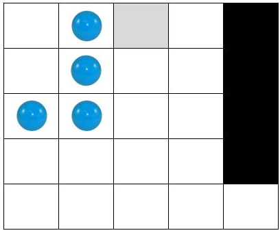

Не е дозволено топчињата да излегуваат од таблата. Целта е на таблата да остане точно едно топче кое ќе биде
позиционирано во централното поле во првата редица, како што е прикажано на Слика 3. Потребно е проблемот да се реши во
најмал број на потези т.е. со избирање (кликнување) на најмал можен број на топчиња.

Слика 3: solitare3.png

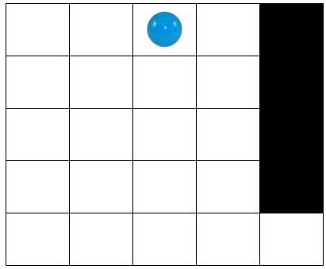

За сите тест примери обликот на таблата е ист како на примерот даден на Слика 1. За секој тест пример се менува
големината N на таблата, како и бројот и распоредот на топчиња и неупотребливи полиња, соодветно. На влез прво се чита
должина и ширина на просторот. Потоа се чита бројот на топчиња. Во наредните линии се читаат позициите на топчињата. На
крај се читаат бројот на препреките и во наредна линија позиција на препрека.

Движењата на топчињата (потезите) потребно е да ги именувате на следниот начин:

- GoreLevo: (x: x_val, y: y_val) - за преместување во насока горе-лево на топчето кое се наоѓа во x координатата x_val и
  y координатата y_val (ако таблата ја гледате во стандардниот координатен систем)
- GoreDesno: (x: x_val, y: y_val) - за преместување во насока горе-десно на топчето кое се наоѓа во x координатата x_val
  и y координатата y_val (ако таблата ја гледате во стандардниот координатен систем)
- DoluLevo: (x: x_val, y: y_val) - за преместување во насока долу-лево на топчето кое се наоѓа во x координатата x_val и
  y координатата y_val (ако таблата ја гледате во стандардниот координатен систем)
- DoluDesno: (x: x_val, y: y_val) - за преместување во насока долу-десно на топчето кое се наоѓа во x координатата x_val
  и y координатата y_val (ако таблата ја гледате во стандардниот координатен систем)
- Levo: (x: x_val, y: y_val) - за преместување налево на топчето кое се наоѓа во x координатата x_val и y координатата
  y_val (ако таблата ја гледате во стандардниот координатен систем)
- Desno: (x: x_val, y: y_val) - за преместување надесно на топчето кое се наоѓа во x координатата x_val и y координатата
  y_val (ако таблата ја гледате во стандардниот координатен систем).

````
For example:
Input
5
5
2,0
1,1
1,2
1,3
1,4
4
4,1
4,2
4,3
4,4

Result
['Gore Levo: (x=2,y=0)', 'Desno: (x=0,y=2)', 'Gore Levo: (x=2,y=2)', 'Desno: (x=0,y=4)']
====================
Input
7
6
1,0
2,0
4,1
4,3
4,5
4,6
17
0,0
5,0
6,0
0,1
1,1
5,1
6,1
0,2
6,2
0,3
6,3
0,4
6,4
0,5
6,5
0,6
6,6

Result
['Desno: (x=1,y=0)', 'Gore Desno: (x=3,y=0)', 'Gore Levo: (x=5,y=2)', 'Gore Desno: (x=3,y=4)', 'Levo: (x=5,y=6)']
====================
Input
7
8
2,2
4,2
2,3
4,3
2,5
4,5
2,6
5,6
8
0,0
1,0
5,0
6,0
0,1
1,1
5,1
6,1

Result
['Dolu Levo: (x=5,y=6)', 'Dolu Levo: (x=3,y=4)', 'Desno: (x=1,y=2)', 'Desno: (x=3,y=2)', 'Gore Levo: (x=5,y=2)', 'Gore Levo: (x=3,y=4)', 'Desno: (x=1,y=6)']
====================
Input
5
6
1,0
3,0
4,0
1,1
1,3
1,4
8
0,1
4,1
3,2
4,2
3,3
4,3
3,4
4,4

Result
['Levo: (x=4,y=0)', 'Levo: (x=2,y=0)', 'Gore Desno: (x=0,y=0)', 'Gore Levo: (x=2,y=2)', 'Desno: (x=0,y=4)']
====================
Input
7
10
2,2
4,2
2,3
4,3
2,4
2,5
4,5
1,6
2,6
4,6
7
0,0
1,0
2,0
3,0
4,0
5,0
6,0

Result
['Desno: (x=1,y=6)', 'Dolu Levo: (x=3,y=6)', 'Desno: (x=1,y=4)', 'Dolu Levo: (x=3,y=4)', 'Desno: (x=1,y=2)', 'Desno: (x=3,y=2)', 'Gore Levo: (x=5,y=2)', 'Gore Desno: (x=3,y=4)', 'Levo: (x=5,y=6)']
====================
Input
9
14
1,0
3,0
5,0
7,0
1,1
7,1
1,3
7,3
1,5
7,5
2,6
3,6
5,6
3,7
0

Result
['Dolu Levo: (x=2,y=6)', 'Dolu Desno: (x=0,y=4)', 'Dolu Levo: (x=2,y=2)', 'Desno: (x=0,y=0)', 'Desno: (x=2,y=0)', 'Desno: (x=4,y=0)', 'Desno: (x=6,y=0)', 'Gore Levo: (x=8,y=0)', 'Gore Desno: (x=6,y=2)', 'Gore Levo: (x=8,y=4)', 'Levo: (x=6,y=6)', 'Levo: (x=4,y=6)', 'Gore Desno: (x=2,y=6)']
====================
Input
5
1
2,4
12
0,0
2,0
4,0
1,1
3,1
0,2
2,2
4,2
1,3
3,3
0,4
4,4

Result
[]
====================
Input
11
1
5,10
38
0,1
1,1
2,1
3,1
7,1
8,1
9,1
10,1
4,2
5,2
6,2
0,3
1,3
2,3
3,3
7,3
8,3
9,3
10,3
0,7
1,7
2,7
3,7
7,7
8,7
9,7
10,7
4,8
5,8
6,8
0,9
1,9
2,9
3,9
7,9
8,9
9,9
10,9

Result
[]
====================
Input
11
12
4,1
6,1
8,2
2,3
8,3
7,4
2,5
4,6
6,6
8,6
8,7
6,9
0

Result
['Dolu Desno: (x=7,y=4)', 'Levo: (x=9,y=2)', 'Dolu Levo: (x=7,y=2)', 'Gore Levo: (x=5,y=0)', 'Gore Levo: (x=3,y=2)', 'Gore Desno: (x=1,y=4)', 'Desno: (x=3,y=6)', 'Desno: (x=5,y=6)', 'Desno: (x=7,y=6)', 'Gore Levo: (x=9,y=6)', 'Gore Levo: (x=7,y=8)']
====================
Input
7
8
2,1
4,1
2,2
4,2
5,2
4,3
2,4
2,5
4
0,0
1,0
5,0
6,0
0,6
1,6
5,6
6,6

Result
['Dolu Levo: (x=5,y=2)', 'Gore Levo: (x=3,y=0)', 'Desno: (x=1,y=2)', 'Desno: (x=3,y=2)', 'Gore Levo: (x=5,y=2)', 'Levo: (x=3,y=4)', 'Gore Desno: (x=1,y=4)']
````

## Задача 8 - coloring_tiles

Предложете соодветна репрезентација и напишете ги потребните функции во Python за да се реши следниот проблем за кој
една можна почетна состојба е прикажана на Слика 1:

Слика 1: flip1.png

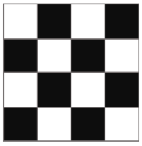

Tабла со димензии N x N се состои од бели и црни полиња. Со избор (кликнување) на едно поле се прави промена на бојата
на тоа поле и на сите негови непосредни соседи (горе, долу, лево и десно) во спротивната боја, како што е прикажано на
Слика 2. Целта е сите полиња на таблата да бидат обоени во црна боја. Потребно е проблемот да се реши во најмал број на
потези т.е. со избирање (кликнување) на најмал можен број на полиња.

Слика 2: flip2.png

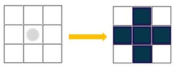

За сите тест примери обликот на таблата е ист како на примерот даден на Слика 1. За секој тест пример се менува
големината N на таблата, како и распоредот на црни и бели полиња на неа, соодветно.

Во рамки на почетниот код даден за задачата се вчитуваат влезните аргументи за секој тест пример. Во променливата n ја
имате големината на таблата (бројот на редици односно колони); во променливата fields ја имате бојата на сите полиња на
таблата (по редослед: одлево - надесно, редица по редица, ако таблата ја гледате како матрица), каде 1 означува дека
полето е обоено во црна, а 0 означува дека полето е обоено во бела боја.

Изборот на полиња (потезите) потребно е да ги именувате на следниот начин:

- x: redica, y: kolona

каде redica и kolona се редицата и колоната на избраното (кликнатото) поле (ако таблата ја гледате како матрица).

Вашиот код треба да има само еден повик на функција за приказ на стандарден излез (print) со кој ќе ја вратите
секвенцата на потези која треба да се направи за да може сите полиња на таблата да бидат обоени во црна боја. Треба да
примените неинформирано пребарување. Врз основа на тест примерите треба самите да определите кое пребарување ќе го
користите.

````
For example:
Input
3
0,0,0,1,0,0,1,1,0

Result
['x: 0, y: 0', 'x: 0, y: 2', 'x: 1, y: 1', 'x: 2, y: 2']
====================
Input
3
1,0,0,1,0,0,1,1,0

Expected
['x: 1, y: 1', 'x: 1, y: 2', 'x: 2, y: 0', 'x: 2, y: 1', 'x: 2, y: 2']
====================
Input
2
1,0,1,1

Expected
['x: 0, y: 0', 'x: 0, y: 1', 'x: 1, y: 1']
====================
Input
4
0,0,1,1,0,1,1,1,1,1,1,1,1,1,1,1

Expected
['x: 0, y: 0']
====================
Input
4
1,1,1,1,1,1,1,1,1,1,1,1,1,1,1,1

Expected
[]
====================
Input
2
1,0,1,0

Expected
['x: 0, y: 0', 'x: 1, y: 0']
====================
Input
3
1,1,1,1,0,0,1,1,0

Expected
['x: 0, y: 0', 'x: 0, y: 2', 'x: 1, y: 0', 'x: 1, y: 2', 'x: 2, y: 1', 'x: 2, y: 2']
====================
Input
3
1,1,0,1,0,0,1,1,0

Expected
['x: 1, y: 2']
====================
Input
3
1,1,1,0,0,0,1,1,0
['x: 0, y: 0', 'x: 1, y: 0', 'x: 1, y: 1', 'x: 2, y: 1']
====================
Input
2
0,0,0,0
['x: 0, y: 0', 'x: 0, y: 1', 'x: 1, y: 0', 'x: 1, y: 1']
````

## Задача 9 - snake_uninformed

Предложете соодветна репрезентација и напишете ги потребните функции во Python за да се реши следниот проблем за кој
една можна почетна состојба е прикажана на Слика 1: snake1.png

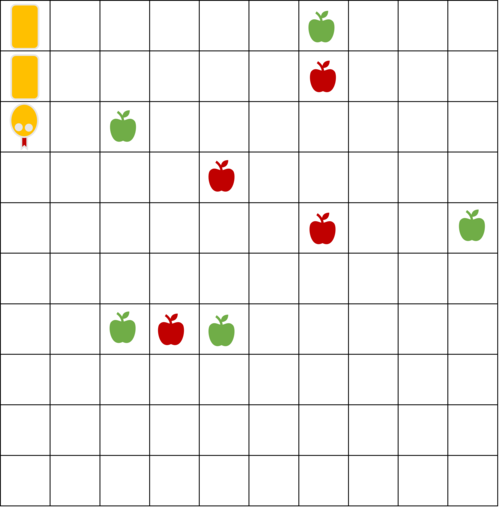

„Во табла со димензии 10x10 се наоѓаат змија, зелени јаболки и црвени јаболки. Потребно е змијата да ги изеде зелените
јаболки, а да ги одбегнува црвените јаболки кои се отровни. Змијата на почетокот зафаќа три полиња од таблата, едно поле
за главата и две полиња за телото. При секое јадење на зелена јаболка телото на змијата се издолжува на крајот за едно
поле (пример Слика 2). Во даден момент можни се три акции на движење на змијата: продолжи право, сврти лево и сврти
десно. При движењето на змијата треба да се внимава змијата да не се изеде сама себе (колизија на главата на змијата со
некој дел од телото) и да не излезе надвор од таблата. Потребно е проблемот да се реши во најмал број на потези.“

Слика 2: snake2.png

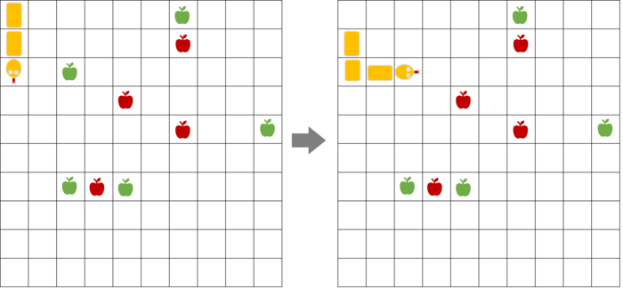

За сите тест примери изгледот и големината на таблата се исти како на примерот даден на сликата. За сите тест примери
почетната позиција на змијата е иста. За секој тест пример се менува бројот и почетната позиција на зелените и црвените
јаболки.

Во рамки на почетниот код даден за задачата се вчитуваат влезните аргументи за секој тест пример. Во променливата
crveni_jabolki се сочувани позициите на црвените јаболки (како листа од торки), а во променливата zeleni_jabolki се
сочувани позициите на зелените јаболки. Табелата се претставува како координатен систем со координати x и y почнувајќи
од нула, па соодветно, позициите се зададени како торка со прв елемент x и втор елемент y.

Движењата на змијата треба да ги именувате на следниот начин:
ProdolzhiPravo - змијата се придвижува за едно поле нанапред
SvrtiDesno - змијата се придвижува за едно поле на десно
SvrtiLevo - змијата се придвижува за едно поле на лево

Вашиот код треба да има само еден повик на функција за приказ на стандарден излез (print) со кој ќе ја вратите
секвенцата на движења која змијата треба да ја направи за да може да ги изеде сите зелени јаболки. Да се најде решението
со најмал број на преземени акции употребувајќи некој алгоритам за неинформирано пребарување. Врз основа на тест
примерите треба самите да определите кое пребарување ќе го користите.

````
For example:
Input
5
6,9
2,7
9,5
2,3
4,3
4
4,6
6,5
3,3
6,8

Result
['SvrtiLevo', 'ProdolzhiPravo', 'SvrtiDesno', 'ProdolzhiPravo', 'ProdolzhiPravo', 'ProdolzhiPravo', 'ProdolzhiPravo', 'SvrtiLevo', 'ProdolzhiPravo', 'SvrtiLevo', 'ProdolzhiPravo', 'SvrtiDesno', 'ProdolzhiPravo', 'ProdolzhiPravo', 'ProdolzhiPravo', 'ProdolzhiPravo', 'SvrtiLevo', 'ProdolzhiPravo', 'ProdolzhiPravo', 'ProdolzhiPravo', 'ProdolzhiPravo', 'SvrtiLevo', 'ProdolzhiPravo', 'ProdolzhiPravo']
====================
Input
0
4
4,6
6,5
3,6
6,8

Result
[]
====================
Input
6
3,7
4,7
5,7
5,5
3,5
3,9
5
3,8
4,6
0,6
1,6
2,6

Result
['SvrtiLevo', 'ProdolzhiPravo', 'ProdolzhiPravo', 'SvrtiDesno', 'ProdolzhiPravo', 'SvrtiLevo', 'ProdolzhiPravo', 'SvrtiLevo', 'ProdolzhiPravo', 'SvrtiLevo', 'SvrtiDesno', 'ProdolzhiPravo', 'SvrtiLevo']
====================
Input
5
1,7
2,7
0,4
1,5
2,6
6
0,6
0,5
3,5
1,4
2,4
3,4

Result
['SvrtiLevo', 'SvrtiDesno', 'ProdolzhiPravo', 'SvrtiLevo', 'SvrtiLevo', 'ProdolzhiPravo', 'SvrtiDesno', 'ProdolzhiPravo', 'SvrtiDesno', 'ProdolzhiPravo', 'ProdolzhiPravo', 'ProdolzhiPravo', 'SvrtiDesno', 'ProdolzhiPravo', 'ProdolzhiPravo', 'ProdolzhiPravo', 'SvrtiDesno']
====================
Input
7
3,6
4,7
4,5
4,4
4,3
5,4
6,5
7
3,9
3,8
3,7
5,7
3,5
5,5
5,3

Result
['ProdolzhiPravo', 'SvrtiLevo', 'ProdolzhiPravo', 'ProdolzhiPravo', 'ProdolzhiPravo', 'SvrtiDesno', 'ProdolzhiPravo', 'SvrtiLevo', 'ProdolzhiPravo', 'SvrtiLevo', 'ProdolzhiPravo', 'ProdolzhiPravo', 'ProdolzhiPravo', 'SvrtiLevo', 'ProdolzhiPravo', 'SvrtiLevo', 'ProdolzhiPravo', 'ProdolzhiPravo', 'ProdolzhiPravo', 'ProdolzhiPravo']
====================
Input
7
2,5
4,7
4,3
5,4
5,7
6,5
8,7
11
1,7
1,6
1,5
1,4
2,8
2,2
3,8
3,6
3,5
3,4
3,3

Result
['ProdolzhiPravo', 'ProdolzhiPravo', 'ProdolzhiPravo', 'ProdolzhiPravo', 'SvrtiLevo', 'ProdolzhiPravo', 'SvrtiLevo', 'ProdolzhiPravo', 'ProdolzhiPravo', 'ProdolzhiPravo', 'SvrtiDesno', 'ProdolzhiPravo', 'ProdolzhiPravo', 'ProdolzhiPravo', 'ProdolzhiPravo', 'ProdolzhiPravo', 'SvrtiDesno', 'ProdolzhiPravo', 'SvrtiDesno', 'ProdolzhiPravo', 'ProdolzhiPravo', 'SvrtiLevo', 'ProdolzhiPravo', 'SvrtiDesno']
====================
Input
8
0,4
1,4
2,5
2,3
3,6
3,4
4,5
4,4
11
1,6
1,5
1,3
2,7
2,2
3,7
4,7
3,3
3,5
5,6
5,5

Result
['ProdolzhiPravo', 'ProdolzhiPravo', 'ProdolzhiPravo', 'SvrtiLevo', 'ProdolzhiPravo', 'ProdolzhiPravo', 'ProdolzhiPravo', 'ProdolzhiPravo', 'ProdolzhiPravo', 'ProdolzhiPravo', 'SvrtiDesno', 'SvrtiDesno', 'ProdolzhiPravo', 'ProdolzhiPravo', 'SvrtiDesno', 'ProdolzhiPravo', 'ProdolzhiPravo', 'SvrtiLevo', 'ProdolzhiPravo', 'SvrtiLevo', 'ProdolzhiPravo', 'ProdolzhiPravo']
````

## Задача 10 - snake_informed

Во табла со димензии 10x10 се наоѓаат змија и зелени јаболки. Потребно е змијата да ги изеде зелените јаболки. Змијата
на почетокот зафаќа три полиња од таблата, едно поле за главата и две полиња за телото. При секое јадење на зелена
јаболка телото на змијата се издолжува на крајот за едно поле. Во даден момент можни се три акции на движење на змијата:
продолжи право, сврти лево и сврти десно. При движењето на змијата треба да се внимава змијата да не се изеде сама
себе (колизија на главата на змијата со некој дел од телото) и да не излезе надвор од таблата. Потребно е проблемот да
се реши во најмал број на потези.

За сите тест примери изгледот и големината на таблата се исти. За сите тест примери почетната позиција на змијата е
иста. За секој тест пример се менува бројот и почетната позиција на зелените јаболки.

Во рамки на почетниот код даден за задачата се вчитуваат влезните аргументи за секој тест пример. Во променливата
zeleni_jabolki се сочувани позициите на зелените јаболки. Табелата се претставува како координатен систем со координати
x и y почнувајќи од нула, па соодветно, позициите се зададени како торка со прв елемент x и втор елемент y.

Движењата на змијата треба да ги именувате на следниот начин:

- ProdolzhiPravo - змијата се придвижува за едно поле нанапред
- SvrtiDesno - змијата се придвижува за едно поле на десно
- SvrtiLevo - змијата се придвижува за едно поле на лево

Вашиот код треба да има само еден повик на функција за приказ на стандарден излез (print) со кој ќе ја вратите
секвенцата на движења која змијата треба да ја направи за да може да ги изеде сите зелени јаболки. Да се најде решението
со најмал број на преземени акции употребувајќи информирано пребарување. Дефинирајте прифатлива хевристичка функција за
информираниот алгоритам.

````
For example:
Input
2
6,9
2,7
Result
['SvrtiLevo', 'ProdolzhiPravo', 'ProdolzhiPravo', 'ProdolzhiPravo', 'ProdolzhiPravo', 'ProdolzhiPravo', 'SvrtiLevo', 'ProdolzhiPravo']
====================
Input
0

Result
[]
====================
Input
3
2,7
2,3
4,3

Result
['SvrtiLevo', 'ProdolzhiPravo', 'SvrtiDesno', 'ProdolzhiPravo', 'ProdolzhiPravo', 'ProdolzhiPravo', 'SvrtiLevo', 'ProdolzhiPravo']


Input
7
3,7
4,7
5,7
5,5
4,5
3,5
3,9

Result
['SvrtiLevo', 'SvrtiLevo', 'ProdolzhiPravo', 'SvrtiDesno', 'ProdolzhiPravo', 'SvrtiDesno', 'ProdolzhiPravo', 'SvrtiLevo', 'ProdolzhiPravo', 'SvrtiDesno', 'ProdolzhiPravo', 'SvrtiDesno', 'ProdolzhiPravo']
====================
Input
5
1,7
2,7
0,4
1,5
2,6

Result
['SvrtiLevo', 'ProdolzhiPravo', 'SvrtiDesno', 'ProdolzhiPravo', 'SvrtiDesno', 'SvrtiLevo', 'SvrtiDesno']


Input
3
0,4
1,5
2,6

Result
['ProdolzhiPravo', 'ProdolzhiPravo', 'ProdolzhiPravo', 'SvrtiLevo', 'SvrtiLevo', 'SvrtiDesno', 'SvrtiLevo']
````

## Задача 11 - football_uninformed

Дадена е табла 8x6, каде што се поставени човече и топка. Потребно е човечето со туркање на топката да ја доведе до
голот кој е обележан со сива боја. На таблата дополнително има противници кои се обележани со сина боја. Противниците се
статични и не се движат.

Човечето може да се движи во пет насоки: горе, долу, десно, горе-десно и долу-десно за една позиција. При движењето,
доколку пред него се наоѓа топката, може да ја турне топката во насоката во која се движи. Човечето не може да се наоѓа
на истото поле како топката или некој од противниците. Топката исто така не може да се наоѓа на поле кое е соседно со
некој од противниците (хоризнотално, вертикално или дијагонално) или на исто поле со некој од противниците.

На слика 1 е покажана една можна почетна состојба на таблата.

Слика 1: football.png

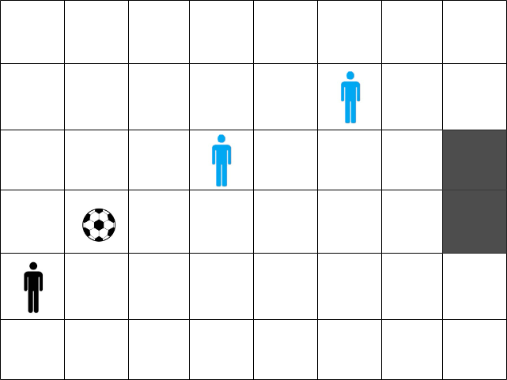

За сите тест примери големината на таблата е иста, а позицијата на човечето и топката се менуваат и се читаат од
стандарден влез. Позицијата на противниците и голот е иста за сите тест примери. Ваша задача е да го имплементирате
поместувањето на човечето (со тоа и туркањето на топката) во successor функцијата. Акциите се именуваат како „Pomesti
coveche gore/dolu/desno/gore-desno/dolu-desno“ ако се поместува човечето, или како „Turni topka
gore/dolu/desno/gore-desno/dolu-desno“ ако при поместувањето на чoвечето се турнува и топката. Дополнително, потребно е
да проверите дали сте стигнале до целта, односно да ја имплементирате функцијата goal_test и да проверите дали
состојбата е валидна, односно да ја дополните функцијата check_valid. Треба да примените неинформирано пребарување за да
најдете решение со најмал број на чекори.

````
For example:
Input
0,1
1,2

Result
['Pomesti coveche gore', 'Pomesti coveche gore', 'Turni topka dolu-desno', 'Pomesti coveche dolu', 'Turni topka desno', 'Turni topka desno', 'Turni topka desno', 'Pomesti coveche dolu', 'Turni topka gore-desno', 'Turni topka gore-desno']
````

## Задача 12 - football_informed

Дадена е табла 8x6, каде што се поставени човече и топка. Потребно е човечето со туркање на топката да ја доведе до
голот кој е обележан со сива боја. На таблата дополнително има противници кои се обележани со сина боја. Противниците се
статични и не се движат.

Човечето може да се движи во пет насоки: горе, долу, десно, горе-десно и долу-десно за една позиција. При движењето,
доколку пред него се наоѓа топката, може да ја турне топката во насоката во која се движи. Топката не може да се влече,
туку само да се турка. Човечето не може да се наоѓа на истото поле како топката или некој од противниците. Топката исто
така не може да се наоѓа на поле кое е соседно со некој од противниците (хоризнотално, вертикално или дијагонално) или
на исто поле со некој од противниците.

На слика 1 е покажана една можна почетна состојба на таблата.

Слика 1: football.png


За сите тест примери големината на таблата е иста, а позицијата на човечето и топката се менуваат и се читаат од
стандарден влез. Позицијата на противниците и голот е иста за сите тест примери. Ваша задача е да го имплементирате
поместувањето на човечето (со тоа и туркањето на топката) во successor функцијата. Акциите се именуваат како „Pomesti
coveche gore/dolu/desno/gore-desno/dolu-desno“ ако се поместува човечето, или како „Turni topka
gore/dolu/desno/gore-desno/dolu-desno“ ако при поместувањето на чoвечето се турнува и топката. Дополнително, потребно е
да проверите дали сте стигнале до целта, односно да ја имплементирате функцијата goal_test и да проверите дали
состојбата е валидна, односно да ја дополните функцијата check_valid. Треба да примените информирано пребарување за да
најдете решение со најмал број на чекори.

````
For example:
Input
0,1
1,2

Result
['Pomesti coveche gore', 'Pomesti coveche gore', 'Turni topka dolu-desno', 'Pomesti coveche dolu', 'Turni topka desno', 'Turni topka desno', 'Turni topka desno', 'Pomesti coveche dolu', 'Turni topka gore-desno', 'Turni topka gore-desno']
````

````
Starter code:
import bisect
import math

"""
Дефинирање на класа за структурата на проблемот кој ќе го решаваме со пребарување.
Класата Problem е апстрактна класа од која правиме наследување за дефинирање на основните 
карактеристики на секој проблем што сакаме да го решиме
"""


class Problem:
    def __init__(self, initial, goal=None):
        self.initial = initial
        self.goal = goal

    def successor(self, state):
        """За дадена состојба, врати речник од парови {акција : состојба}
        достапни од оваа состојба. Ако има многу следбеници, употребете
        итератор кој би ги генерирал следбениците еден по еден, наместо да
        ги генерирате сите одеднаш.

        :param state: дадена состојба
        :return:  речник од парови {акција : состојба} достапни од оваа
                  состојба
        :rtype: dict
        """
        raise NotImplementedError

    def actions(self, state):
        """За дадена состојба state, врати листа од сите акции што може да
        се применат над таа состојба

        :param state: дадена состојба
        :return: листа на акции
        :rtype: list
        """
        raise NotImplementedError

    def result(self, state, action):
        """За дадена состојба state и акција action, врати ја состојбата
        што се добива со примена на акцијата над состојбата

        :param state: дадена состојба
        :param action: дадена акција
        :return: резултантна состојба
        """
        raise NotImplementedError

    def goal_test(self, state):
        """Врати True ако state е целна состојба. Даденава имплементација
        на методот директно ја споредува state со self.goal, како што е
        специфицирана во конструкторот. Имплементирајте го овој метод ако
        проверката со една целна состојба self.goal не е доволна.

        :param state: дадена состојба
        :return: дали дадената состојба е целна состојба
        :rtype: bool
        """
        return state == self.goal

    def path_cost(self, c, state1, action, state2):
        """Врати ја цената на решавачкиот пат кој пристигнува во состојбата
        state2 од состојбата state1 преку акцијата action, претпоставувајќи
        дека цената на патот до состојбата state1 е c. Ако проблемот е таков
        што патот не е важен, оваа функција ќе ја разгледува само состојбата
        state2. Ако патот е важен, ќе ја разгледува цената c и можеби и
        state1 и action. Даденава имплементација му доделува цена 1 на секој
        чекор од патот.

        :param c: цена на патот до состојбата state1
        :param state1: дадена моментална состојба
        :param action: акција која треба да се изврши
        :param state2: состојба во која треба да се стигне
        :return: цена на патот по извршување на акцијата
        :rtype: float
        """
        return c + 1

    def value(self):
        """За проблеми на оптимизација, секоја состојба си има вредност. 
        Hill-climbing и сличните алгоритми се обидуваат да ја максимизираат
        оваа вредност.

        :return: вредност на состојба
        :rtype: float
        """
        raise NotImplementedError


"""
Дефинирање на класата за структурата на јазел од пребарување.
Класата Node не се наследува
"""


class Node:
    def __init__(self, state, parent=None, action=None, path_cost=0):
        """Креирај јазол од пребарувачкото дрво, добиен од parent со примена
        на акцијата action

        :param state: моментална состојба (current state)
        :param parent: родителска состојба (parent state)
        :param action: акција (action)
        :param path_cost: цена на патот (path cost)
        """
        self.state = state
        self.parent = parent
        self.action = action
        self.path_cost = path_cost
        self.depth = 0  # search depth
        if parent:
            self.depth = parent.depth + 1

    def __repr__(self):
        return "<Node %s>" % (self.state,)

    def __lt__(self, node):
        return self.state < node.state

    def expand(self, problem):
        """Излистај ги јазлите достапни во еден чекор од овој јазол.

        :param problem: даден проблем
        :return: листа на достапни јазли во еден чекор
        :rtype: list(Node)
        """

        return [self.child_node(problem, action)
                for action in problem.actions(self.state)]

    def child_node(self, problem, action):
        """Дете јазел

        :param problem: даден проблем
        :param action: дадена акција
        :return: достапен јазел според дадената акција
        :rtype: Node
        """
        next_state = problem.result(self.state, action)
        return Node(next_state, self, action,
                    problem.path_cost(self.path_cost, self.state,
                                      action, next_state))

    def solution(self):
        """Врати ја секвенцата од акции за да се стигне од коренот до овој јазол.

        :return: секвенцата од акции
        :rtype: list
        """
        return [node.action for node in self.path()[1:]]

    def solve(self):
        """Врати ја секвенцата од состојби за да се стигне од коренот до овој јазол.

        :return: листа од состојби
        :rtype: list
        """
        return [node.state for node in self.path()[0:]]

    def path(self):
        """Врати ја листата од јазли што го формираат патот од коренот до овој јазол.

        :return: листа од јазли од патот
        :rtype: list(Node)
        """
        x, result = self, []
        while x:
            result.append(x)
            x = x.parent
        result.reverse()
        return result

    """Сакаме редицата од јазли кај breadth_first_search или 
    astar_search да не содржи состојби - дупликати, па јазлите што
    содржат иста состојба ги третираме како исти. [Проблем: ова може
    да не биде пожелно во други ситуации.]"""

    def __eq__(self, other):
        return isinstance(other, Node) and self.state == other.state

    def __hash__(self):
        return hash(self.state)


"""
Дефинирање на помошни структури за чување на листата на генерирани, но непроверени јазли
"""

class Queue:
        """
        Queue е апстрактна класа / интерфејс. Постојат 3 типа:
        Stack(): Last In First Out Queue (стек).
        FIFOQueue(): First In First Out Queue (редица).
        PriorityQueue(order, f): Queue во сортиран редослед (подразбирливо,од најмалиот кон
                                 најголемиот јазол).
        """

    def __init__(self):
        raise NotImplementedError

    def append(self, item):
        """Додади го елементот item во редицата

        :param item: даден елемент
        :return: None
        """
        raise NotImplementedError

    def extend(self, items):
        """Додади ги елементите items во редицата

        :param items: дадени елементи
        :return: None
        """
        raise NotImplementedError

    def pop(self):
        """Врати го првиот елемент од редицата

        :return: прв елемент
        """
        raise NotImplementedError

    def __len__(self):
        """Врати го бројот на елементи во редицата

        :return: број на елементи во редицата
        :rtype: int
        """
        raise NotImplementedError

    def __contains__(self, item):
        """Проверка дали редицата го содржи елементот item

        :param item: даден елемент
        :return: дали queue го содржи item
        :rtype: bool
        """
        raise NotImplementedError


class Stack(Queue):
    """Last-In-First-Out Queue."""

    def __init__(self):
        self.data = []

    def append(self, item):
        self.data.append(item)

    def extend(self, items):
        self.data.extend(items)

    def pop(self):
        return self.data.pop()

    def __len__(self):
        return len(self.data)

    def __contains__(self, item):
        return item in self.data


class FIFOQueue(Queue):
    """First-In-First-Out Queue."""

    def __init__(self):
        self.data = []

    def append(self, item):
        self.data.append(item)

    def extend(self, items):
        self.data.extend(items)

    def pop(self):
        return self.data.pop(0)

    def __len__(self):
        return len(self.data)

    def __contains__(self, item):
        return item in self.data


class PriorityQueue(Queue):
    """Редица во која прво се враќа минималниот (или максималниот) елемент
    (како што е определено со f и order). Оваа структура се користи кај
    информирано пребарување"""
    """"""

    def __init__(self, order=min, f=lambda x: x):
        """
        :param order: функција за подредување, ако order е min, се враќа елементот
                      со минимална f(x); ако order е max, тогаш се враќа елементот
                      со максимална f(x).
        :param f: функција f(x)
        """
        assert order in [min, max]
        self.data = []
        self.order = order
        self.f = f

    def append(self, item):
        bisect.insort_right(self.data, (self.f(item), item))

    def extend(self, items):
        for item in items:
            bisect.insort_right(self.data, (self.f(item), item))

    def pop(self):
        if self.order == min:
            return self.data.pop(0)[1]
        return self.data.pop()[1]

    def __len__(self):
        return len(self.data)

    def __contains__(self, item):
        return any(item == pair[1] for pair in self.data)

    def __getitem__(self, key):
        for _, item in self.data:
            if item == key:
                return item

    def __delitem__(self, key):
        for i, (value, item) in enumerate(self.data):
            if item == key:
                self.data.pop(i)


from sys import maxsize as infinity

"""
Информирано пребарување во рамки на граф
"""


def memoize(fn, slot=None):
    """ Запамети ја пресметаната вредност за која била листа од
    аргументи. Ако е специфициран slot, зачувај го резултатот во
    тој slot на првиот аргумент. Ако slot е None, зачувај ги
    резултатите во речник.

    :param fn: зададена функција
    :type fn: function
    :param slot: име на атрибут во кој се чуваат резултатите од функцијата
    :type slot: str
    :return: функција со модификација за зачувување на резултатите
    :rtype: function
    """
    if slot:
        def memoized_fn(obj, *args):
            if hasattr(obj, slot):
                return getattr(obj, slot)
            else:
                val = fn(obj, *args)
                setattr(obj, slot, val)
                return val
    else:
        def memoized_fn(*args):
            if args not in memoized_fn.cache:
                memoized_fn.cache[args] = fn(*args)
            return memoized_fn.cache[args]

        memoized_fn.cache = {}
    return memoized_fn


def best_first_graph_search(problem, f):
    """Пребарувај низ следбениците на даден проблем за да најдеш цел. Користи
     функција за евалуација за да се одлучи кој е сосед најмногу ветува и
     потоа да се истражи. Ако до дадена состојба стигнат два пата, употреби
     го најдобриот пат.

    :param problem: даден проблем
    :type problem: Problem
    :param f: дадена функција за евалуација (проценка)
    :type f: function
    :return: Node or None
    :rtype: Node
    """
    f = memoize(f, 'f')
    node = Node(problem.initial)
    if problem.goal_test(node.state):
        return node
    frontier = PriorityQueue(min, f)
    frontier.append(node)
    explored = set()
    while frontier:
        node = frontier.pop()
        if problem.goal_test(node.state):
            return node
        explored.add(node.state)
        for child in node.expand(problem):
            if child.state not in explored and child not in frontier:
                frontier.append(child)
            elif child in frontier:
                incumbent = frontier[child]
                if f(child) < f(incumbent):
                    del frontier[incumbent]
                    frontier.append(child)
    return None


def greedy_best_first_graph_search(problem, h=None):
    """ Greedy best-first пребарување се остварува ако се специфицира дека f(n) = h(n).

    :param problem: даден проблем
    :type problem: Problem
    :param h: дадена функција за хевристика
    :type h: function
    :return: Node or None
    """
    h = memoize(h or problem.h, 'h')
    return best_first_graph_search(problem, h)


def astar_search(problem, h=None):
    """ A* пребарување е best-first graph пребарување каде f(n) = g(n) + h(n).

    :param problem: даден проблем
    :type problem: Problem
    :param h: дадена функција за хевристика
    :type h: function
    :return: Node or None
    """
    h = memoize(h or problem.h, 'h')
    return best_first_graph_search(problem, lambda n: n.path_cost + h(n))


def recursive_best_first_search(problem, h=None):
    """Recursive best first search - ја ограничува рекурзијата
    преку следење на f-вредноста на најдобриот алтернативен пат
    од било кој јазел предок (еден чекор гледање нанапред).

    :param problem: даден проблем
    :type problem: Problem
    :param h: дадена функција за хевристика
    :type h: function
    :return: Node or None
    """
    h = memoize(h or problem.h, 'h')

    def RBFS(problem, node, flimit):
        if problem.goal_test(node.state):
            return node, 0  # (втората вредност е неважна)
        successors = node.expand(problem)
        if len(successors) == 0:
            return None, infinity
        for s in successors:
            s.f = max(s.path_cost + h(s), node.f)
        while True:
            # Подреди ги според најниската f вредност
            successors.sort(key=lambda x: x.f)
            best = successors[0]
            if best.f > flimit:
                return None, best.f
            if len(successors) > 1:
                alternative = successors[1].f
            else:
                alternative = infinity
            result, best.f = RBFS(problem, best, min(flimit, alternative))
            if result is not None:
                return result, best.f

    node = Node(problem.initial)
    node.f = h(node)
    result, bestf = RBFS(problem, node, infinity)
    return result


class Football(Problem):
    def __init__(self, initial, goal=None):
        super().__init__(initial, goal)

    def actions(self, state):
        return self.successor(state).keys()

    def result(self, state, action):
        return self.successor(state)[action]

    def goal_test(self, state):
        return state == self.goal

    @staticmethod
    def check_valid(state, opponents):
        man_pos = state[0]
        ball_pos = state[1]
        return man_pos[0] >= 0 and man_pos[0] < 8 and \
            man_pos[1] >= 0 and man_pos[1] < 6 and \
            ball_pos[0] >= 0 and ball_pos[0] < 8 and \
            ball_pos[1] >= 0 and ball_pos[1] < 6

    def successor(self, state):
        successors = dict()

        ...

        return successors

    def h(self, node):
        ...


if __name__ == '__main__':
    man_pos = tuple(map(int, input().split(',')))
    ball_pos = tuple(map(int, input().split(',')))

    opponents = [(3, 3), (5, 4)]

````
## Задача 13 - meeting_csp

Потребно е да се закаже состанок во петок за Марија, Петар и Симона. Симона како менаџер мора да присуствува на
состанокот со најмалку уште една личност. Состанокот трае еден час, и може да се закаже во периодот од 12:00 до 20:00.
Почетокот на состанокот може да биде на секој час, односно состанокот може да почне во 12:00, но не во 12:05, 12:10 итн.
За секој од членовите дадени се времињата во кои се слободни:

- Симона слободни термини: 13:00-15:00, 16:00-17:00, 19:00-20:00
- Марија слободни термини: 14:00-16:00, 18:00-19:00
- Петар слободни термини: 12:00-14:00, 16:00-20:00

Потребно е менаџерот Симона да ги добие сите можни почетни времиња за состанокот. Даден е почетен код со кој е креирана
класа за претставување на проблемот, на кој се додадени променливите. Потоа се повикува наоѓање на решение со
BacktrackingSolver. Ваша задача е да ги додадете домените на променливите, како и да ги додадете ограничувањата (
условите) на проблемот.

**Потсетник:** Во дадениот модул constraint веќе се имплементирани следните ограничувања како класи:
AllDifferentConstraint,
AllEqualConstraint, MaxSumConstraint, ExactSumConstraint, MinSumConstraint, InSetConstraint, NotInSetConstraint,
SomeInSetConstraint, SomeNotInSetConstraint.

For example:

````
Result
{'Simona_prisustvo': 1, 'Marija_prisustvo': 1, 'Petar_prisustvo': 0, 'vreme_sostanok': 14}
{'Simona_prisustvo': 1, 'Marija_prisustvo': 0, 'Petar_prisustvo': 1, 'vreme_sostanok': 19}
{'Simona_prisustvo': 1, 'Marija_prisustvo': 0, 'Petar_prisustvo': 1, 'vreme_sostanok': 16}
{'Simona_prisustvo': 1, 'Marija_prisustvo': 0, 'Petar_prisustvo': 1, 'vreme_sostanok': 13}
````

````
Starter code:
from constraint import *

if __name__ == '__main__':
    problem = Problem(BacktrackingSolver())
    
    # ---Dadeni se promenlivite, dodadete gi domenite-----
    problem.addVariable("Marija_prisustvo", ...)
    problem.addVariable("Simona_prisustvo", ...)
    problem.addVariable("Petar_prisustvo", ...)
    problem.addVariable("vreme_sostanok", ...)
    # ----------------------------------------------------
    
    # ---Tuka dodadete gi ogranichuvanjata----------------
    
    # ----------------------------------------------------
    
    [print(solution) for solution in problem.getSolutions()]
````
## Задача 14 - paper_presentation_schedule

Потребно е да направите распоред за презентација на трудови за некоја конференција. На конференцијата треба да бидат
презентирани вкупно 10 трудови од неколку области: Вештачка интелигенција (AI), Машинско Учење (ML) и Обработка на
природни јазици (NLP). Ваша задача е да направите распоред за конференција по термини и при тоа да се земат предвид
следните ограничувања:

- Во секој од термините може да бидат презентирани најмногу 4 трудови.
- Ако бројот на трудови од дадена област е помал или еднаков на максималниот број трудови кои може да бидат презентирани
  во даден термин, тогаш тие трудови треба да бидат распределени во ист термин.

Од стандарден влез се чита бројот на термини во кои треба да бидат распределени трудовите (**Напомена:** бројот на
термини
секогаш ќе биде 3 или 4). Потоа се читаат информации за секој труд во следниот формат „ID област“.

На стандарден излез да се испечати терминот за презентација за секој труд. **Напомена:** решението ќе се смета за точно
доколку ги добиете истите групи на трудови распределени во различен термин. На пример, следните 2 можни распределби се
сметаат за идентични:

- Paper1 (AI): T1, Paper2 (AI): T1, Paper3 (ML): T2
- Paper1 (AI): T2, Paper2 (AI): T2, Paper3 (ML): T1

Даден е почетен код со кој е креирана класа за претставување на проблемот, на кој се додадени променливите. Потоа се
повикува наоѓање на решение со BacktrackingSolver. Ваша задача е да ги додадете домените на променливите, како и да ги
додадете ограничувањата (условите) на проблемот.

**Потсетник:** Во дадениот модул constraint веќе се имплементирани следните ограничувања како класи:
AllDifferentConstraint,
AllEqualConstraint, MaxSumConstraint, ExactSumConstraint, MinSumConstraint, InSetConstraint, NotInSetConstraint,
SomeInSetConstraint, SomeNotInSetConstraint.

````
For example:
====================
Input
3
Paper1 AI
Paper2 ML
Paper3 AI
Paper4 AI
Paper5 NLP
Paper6 ML
Paper7 ML
Paper8 NLP
Paper9 NLP
Paper10 ML
end

Result
Paper1 (AI): T3
Paper2 (ML): T2
Paper3 (AI): T3
Paper4 (AI): T3
Paper5 (NLP): T1
Paper6 (ML): T2
Paper7 (ML): T2
Paper8 (NLP): T1
Paper9 (NLP): T1
Paper10 (ML): T2
====================
Input
4
Paper1 AI
Paper2 ML
Paper3 AI
Paper4 AI
Paper5 NLP
Paper6 ML
Paper7 ML
Paper8 NLP
Paper9 NLP
Paper10 ML
end

Result
Paper1 (AI): T4
Paper2 (ML): T3
Paper3 (AI): T4
Paper4 (AI): T4
Paper5 (NLP): T2
Paper6 (ML): T3
Paper7 (ML): T3
Paper8 (NLP): T2
Paper9 (NLP): T2
Paper10 (ML): T3
====================
Input
3
Paper1 AI
Paper2 AI
Paper3 AI
Paper4 AI
Paper5 NLP
Paper6 AI
Paper7 NLP
Paper8 NLP
Paper9 NLP
Paper10 NLP
end

Result
Paper1 (AI): T3
Paper2 (AI): T3
Paper3 (AI): T3
Paper4 (AI): T2
Paper5 (NLP): T2
Paper6 (AI): T2
Paper7 (NLP): T2
Paper8 (NLP): T1
Paper9 (NLP): T1
Paper10 (NLP): T3
====================
Input
4
Paper1 AI
Paper2 AI
Paper3 AI
Paper4 AI
Paper5 NLP
Paper6 AI
Paper7 NLP
Paper8 NLP
Paper9 NLP
Paper10 NLP
end

Result
Paper1 (AI): T4
Paper2 (AI): T4
Paper3 (AI): T4
Paper4 (AI): T3
Paper5 (NLP): T3
Paper6 (AI): T3
Paper7 (NLP): T3
Paper8 (NLP): T2
Paper9 (NLP): T2
Paper10 (NLP): T4
====================
Input
3
Paper1 AI
Paper2 AI
Paper3 AI
Paper4 AI
Paper5 AI
Paper6 AI
Paper7 AI
Paper8 NLP
Paper9 NLP
Paper10 NLP
end

Result
Paper1 (AI): T3
Paper2 (AI): T2
Paper3 (AI): T2
Paper4 (AI): T2
Paper5 (AI): T2
Paper6 (AI): T1
Paper7 (AI): T1
Paper8 (NLP): T3
Paper9 (NLP): T3
Paper10 (NLP): T3
````

````
Starter code:
from constraint import *

if __name__ == '__main__':
    num = int(input())
    
    papers = dict()
    
    paper_info = input()
    while paper_info != 'end':
        title, topic = paper_info.split(' ')
        papers[title] = topic
        paper_info = input()
    
    # Tuka definirajte gi promenlivite
    ...
     
    domain = [f'T{i + 1}' for i in range(num)]
    
    problem = Problem(BacktrackingSolver())
    
    # Dokolku vi e potrebno moze da go promenite delot za dodavanje na promenlivite
    problem.addVariables(variables, domain)
    
    # Tuka dodadete gi ogranichuvanjata
    ...
        
    result = problem.getSolution()
    
    # Tuka dodadete go kodot za pechatenje
    ...
````