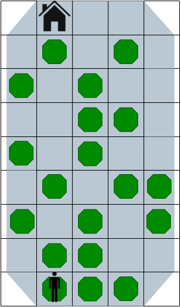
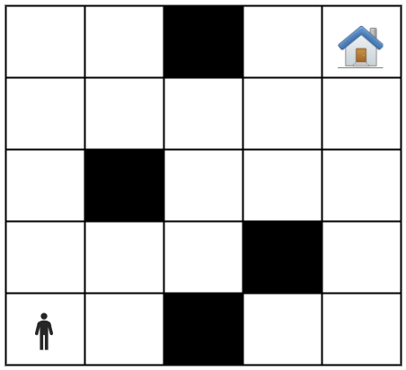

## Задача 1 - house

Дадена е табла 5x9, каде што е поставено човече. Потребно е човечето со качување по ѕидот да стигне до врвот кој е
означен со куќичка.

Човечето може да се движи во три насоки: горе, горе-десно и горе-лево за една или две позиции (дијагонално, не е како
фигурата коњ во шах). Човечето може и да остане на моменталното поле. Притоа човечето може да се наоѓа само на полињата
на кои е поставен зелен осумаголник. Полињата кои не се означени со зелен осумаголник може да се прескокнуваат. Човечето
исто така не смее да излезе од таблата. Куќичката е подвижна и се движи лево и десно за една позиција со секое
поместување (или избор да не се помести) на човечето. Таа може да застане на било кое поле во редот во кој се наоѓа.
Куќичката на почеток се движи во една насока, а кога ќе стигне до крајот на таблата ја менува насоката. Единственото
поле во најгорниот ред на кое може да застане човечето е она на кое се наоѓа куќичката.

На слика 1 е покажана една можна почетна состојба на таблата.

Слика 1: vi_juni.png



За сите тест примери големината на таблата е иста, а позицијата на човечето и куќичката се менуваат и се читаат од
стандарден влез. Притоа куќичката секогаш се наоѓа во најгорниот ред. Почетната насока на куќичката исто така се чита од
стандарден влез. Позицијата на дозволените полиња е иста за сите тест примери. Ваша задача е да го имплементирате
поместувањето на човечето и куќичката во successor функцијата. Акциите се именуваат како „Stoj/Gore 1/Gore 2/Gore-desno
1/Gore-desno 2/Gore-levo 1/Gore-levo 2“. Дополнително, потребно е да проверите дали сте стигнале до целта, односно да ја
имплементирате функцијата goal_test и да проверите дали состојбата е валидна. Треба да примените информирано пребарување
за да најдете решение со најмал број на чекори.

````
For example:
Test 
TC1

Input 
1,0
1,8
desno

Result
['Gore 1', 'Gore 2', 'Gore-desno 2', 'Gore-levo 2', 'Gore-desno 1']
````

## Задача 2 - labyrinth

Даден е лавиринт NxN во кој се движи човече. Во лавиринтот има ѕидови кои се поставени на случајни позиции и истите не
може да се прескокнуваат. Потребно е човечето да стигне до куќичката без притоа да удри во некој ѕид или да излезе
надвор од лавиринтот. Човечето во четири насоки: горе, долу, лево и десно. Со еден потег човечето во десно може да се
помести за две или три позиции, а во сите останати насоки може да се помести само за една позиција. Пример за почетна
состојба е прикажан на следната слика:

Слика: labyrinth.png



За сите тест примери големината на таблата n се чита од стандарден влез. Потоа се чита бројот на ѕидови и позициите на
секој ѕид. На крај се читаат позициите на човечето и куќичката. Ваша задача е да го имплементирате движењето на човечето
во successor функцијата. Акциите се именуваат како „Desno X/Gore/Dolu/Levo“. Потоа имплементирајте ја хевристичката
функција h. Потребно е проблемот да се реши во најмал број на чекори со примена на информирано пребарување.
For example:

````
Test
TC1	

Input
5	
4
2,0
3,1
1,2
2,4
0,0
4,4

Result
['Gore', 'Desno 2', 'Gore', 'Desno 2', 'Gore', 'Gore']
````
